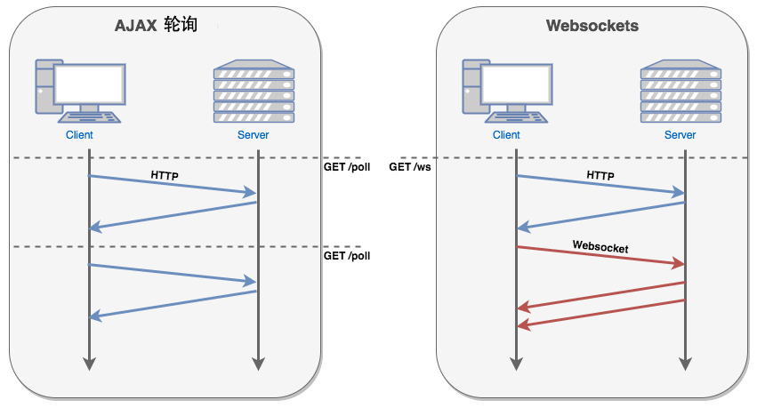
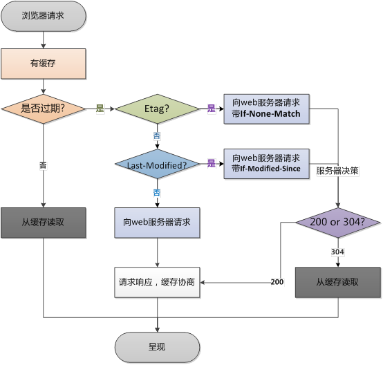

# 浏览器

- [浏览器](#浏览器)
  - [OSI七层与TCP/IP五层模型](#osi七层与tcpip五层模型)
  - [应用层的协议哪些是基于TCP协议的，哪些是基于UDP协议的](#应用层的协议哪些是基于tcp协议的哪些是基于udp协议的)
    - [基于TCP协议的](#基于tcp协议的)
    - [基于UDP协议的](#基于udp协议的)
    - [基于TCP和UDP协议的](#基于tcp和udp协议的)
  - [HTTP 状态码](#http-状态码)
  - [HTTP 与 HTTPS 的区别](#http-与-https-的区别)
  - [HTTPS 协议的工作原理](#https-协议的工作原理)
  - [HTTP/2.0 特性](#http20-特性)
  - [TCP 和 UDP 之间的区别](#tcp-和-udp-之间的区别)
  - [TCP 的三次握手和四次挥手](#tcp-的三次握手和四次挥手)
  - [对称加密和非对称加密的区别](#对称加密和非对称加密的区别)
  - [WebSocket 协议](#websocket-协议)
  - [什么是浏览器的同源政策](#什么是浏览器的同源政策)
  - [HTTP 请求的方式](#http-请求的方式)
  - [GET 和 POST 的区别](#get-和-post-的区别)
  - [浏览器输入 URL 之后发生了什么](#浏览器输入-url-之后发生了什么)
  - [DNS 的具体过程](#dns-的具体过程)
  - [Cookie 和 WebStorage(SessionStorage 和 LocalStorage)的区别](#cookie-和-webstoragesessionstorage-和-localstorage的区别)
  - [cookie 和 session 的区别](#cookie-和-session-的区别)
  - [能设置或读取子域的cookie吗](#能设置或读取子域的cookie吗)
  - [客户端设置cookie与服务端设置cookie有什么区别](#客户端设置cookie与服务端设置cookie有什么区别)
  - [同域/跨域ajax请求到底会不会带上cookie](#同域跨域ajax请求到底会不会带上cookie)
  - [前端攻击技术](#前端攻击技术)
    - [XSS攻击(cross-site script)](#xss攻击cross-site-script)
    - [CSRF攻击(cross site request forgery,跨站请求伪造)](#csrf攻击cross-site-request-forgery跨站请求伪造)
  - [浏览器缓存机制](#浏览器缓存机制)
  - [强缓存 Expires 和 Cache-Control 的使用](#强缓存-expires-和-cache-control-的使用)
    - [Expires](#expires)
      - [Cache-Control](#cache-control)
  - [协商缓存](#协商缓存)
    - [Etag 和 If-None-Match](#etag-和-if-none-match)
    - [Last-Modify / If-Modify-Since](#last-modify--if-modify-since)
    - [为什么要有 Etag](#为什么要有-etag)
  - [进程与线程的区别](#进程与线程的区别)

## OSI七层与TCP/IP五层模型

- OSI七层模型

  ```txt
  应用层
  表示层
  会话层
  传输层
  网络层
  数据链路层
  物理层
  ```

- TCP/IP五层模型

  ```txt
  应用层：TFTP，HTTP，SNMP，FTP，SMTP，DNS，Telnet
  传输层：TCP，UDP
  网络层：IP，ICMP，RIP，OSPF，BGP，IGMP
  数据链路层：SLIP，CSLIP，PPP，ARP，RARP，MTU
  物理层
  ```

## 应用层的协议哪些是基于TCP协议的，哪些是基于UDP协议的

### 基于TCP协议的

- FTP（文件传输协议）：定义了文件传输协议，使用21端口。
- TELNET（远程登陆协议）：一种用于远程登陆的端口，使用23端口，用户可以以自己的身份远程连接到计算机上，可提供基于DOS模式下的通信服务。
- SMTP（简单邮件传输协议）：邮件传送协议，用于发送邮件。服务器开放的是25号端口。
- POP3（邮件读取协议）：它是和SMTP对应，POP3用于接收邮件。POP3协议所用的是110端口。
- HTTP（超文本传输协议）：是从Web服务器传输超文本到本地浏览器的传送协议。
- HTTPS（超文本传输安全协议）

### 基于UDP协议的

- TFTP（简单文件传输协议）：该协议在熟知端口69上使用UDP服务。
- SNMP（简单网络管理协议）：使用161号端口，是用来管理网络设备的。由于网络设备很多，无连接的服务就体现出其优势。
- BOOTP（引导程序协议，DHCP的前身）：应用于无盘设备
- DHCP（动态主机配置协议）：是一个局域网的网络协议
- RIP（路由信息协议）：基于距离矢量算法的路由协议，利用跳数来作为计量标准。
- IGMP（Internet组管理协议）

### 基于TCP和UDP协议的

- DNS（域名系统）：DNS区域传输的时候使用TCP协议。域名解析时使用UDP协议。DNS用的是53号端口。
- ECHO（回绕协议）

## HTTP 状态码

1. 1XX 信息性状态码
   - 100 继续
   - 101 切换协议
2. 2XX 成功状态码
   - 200 OK 成功处理了请求
   - 204 No Content 请求处理成功，但没有资源可返回
   - 206 Partial Content 请求资源的某一部分
3. 3XX 重定向状态码
   - 301 永久性重定向，表示请求的资源已被分配了新的 URI
   - 302 临时性重定向，资源的 URL 已临时定位到其他位置
   - 303 告诉客户端应该用另一个 URL 获取资源
   - 304 表示客户端发送附带条件的请求时，服务器端允许请求访问资源，但未满足条件的情况
4. 4XX 客户端错误状态码
   - 400 表示请求报文中存在语法错误
   - 401 未授权
   - 403 服务器拒绝了请求
   - 404 服务器无法找到所请求的 URL
5. 5XX 服务器错误状态码
   - 500 内部服务器错误
   - 502 错误网关
   - 503 服务器暂时处于超负载或正在进行停机维护，现在无法处理请求。
   - 504 响应超时

## HTTP 与 HTTPS 的区别

1. HTTP 传输的数据都是未加密的，也就是明文的，HTTPS 协议是由 HTTP 和 SSL 协议构建的可进行加密传输和身份认证的网络协议，比 HTTP 协议的安全性更高。
2. HTTPS 协议需要 CA 证书，费用较高；
3. 使用不同的链接方式，端口也不同，一般而言，HTTP 协议的端口为 80，HTTPS 的端口为 443；

## HTTPS 协议的工作原理

1. 客户使用 HTTPS URL 访问服务器，则要求 web 服务器建立 SSL 链接。
2. web 服务器接收到客户端的请求之后，会将网站的证书（证书中包含了公钥），返回给客户端。
3. 客户端和 web 服务器端开始协商 SSL 链接的安全等级，也就是加密等级。
4. 客户端浏览器通过双方协商一致的安全等级，建立会话密钥，然后通过网站的公钥来加密会话密钥，并传送给网站。
5. web 服务器通过自己的私钥解密出会话密钥。
6. web 服务器通过会话密钥加密与客户端之间进行通信。

## HTTP/2.0 特性

> 参考链接：[HTTP/2 相比 1.0 有哪些重大改进？](https://www.zhihu.com/question/34074946)

1. 首部压缩
2. 多路复用
3. 二进制分帧
4. 服务端推送

## TCP 和 UDP 之间的区别

TCP：传输控制协议 UDP：用户数据报协议

1. TCP 是面向连接的，UDP 是无连接的即发送数据前不需要先建立链接；
2. TCP 提供可靠的服务。也就是说，通过 TCP 连接传送的数据，无差错，不丢失，不重复，且按序到达；UDP 尽最大努力交付，即不保证可靠交付。
3. TCP 是面向字节流，UDP 面向报文；
4. TCP 只能是 1 对 1 的，UDP 支持 1 对 1,1 对多；
5. TCP 的首部较大为 20 字节，而 UDP 只有 8 字节；

## TCP 的三次握手和四次挥手

## 对称加密和非对称加密的区别

## WebSocket 协议

> 参考链接：[HTML5 WebSocket](https://www.runoob.com/html/html5-websocket.html)

WebSocket 是 HTML5 开始提供的一种在单个 TCP 连接上进行全双工通讯的协议。

WebSocket 使得客户端和服务器之间的数据交换变得更加简单，允许服务端主动向客户端推送数据。在 WebSocket API 中，浏览器和服务器只需要完成一次握手，两者之间就直接可以创建持久性的连接，并进行双向数据传输。

现在，很多网站为了实现推送技术，所用的技术都是 Ajax 轮询。轮询是在特定的的时间间隔（如每 1 秒），由浏览器对服务器发出 HTTP 请求，然后由服务器返回最新的数据给客户端的浏览器。这种传统的模式带来很明显的缺点，即浏览器需要不断的向服务器发出请求，然而 HTTP 请求可能包含较长的头部，其中真正有效的数据可能只是很小的一部分，显然这样会浪费很多的带宽等资源。



应用场景:实现即时通讯:如股票交易行情分析、聊天室、在线游戏等，替代轮询和长轮询

## 什么是浏览器的同源政策

```HTTP
我对浏览器的同源政策的理解是，一个域下的 js 脚本在未经允许的情况下，不能够访问另一个域的内容。这里的同源的指的是两个
域的协议、域名、端口号必须相同，否则则不属于同一个域。

同源政策主要限制了三个方面

第一个是当前域下的 js 脚本不能够访问其他域下的 cookie、localStorage 和 indexDB。

第二个是当前域下的 js 脚本不能够操作访问其他域下的 DOM。

第三个是当前域下 ajax 无法发送跨域请求。

同源政策的目的主要是为了保证用户的信息安全，它只是对 js 脚本的一种限制，并不是对浏览器的限制，对于一般的 img、或者
script 脚本请求都不会有跨域的限制，这是因为这些操作都不会通过响应结果来进行可能出现安全问题的操作。
```

## HTTP 请求的方式

1. GET：请求指定的页面信息，并返回实体主体。
2. HEAD：类似于 GET 请求，只不过返回的响应中没有具体的内容，用于获取报头
3. POST：向指定资源提交数据进行处理请求（例如提交表单或者上传文件）。数据被包含在请求体中。POST 请求可能会导致新的资源的建立和/或已有资源的修改。
4. PUT：从客户端向服务器传送的数据取代指定的文档的内容。
5. DELETE：请求服务器删除指定的页面。
6. CONNECT：HTTP/1.1 协议中预留给能够将连接改为管道方式的代理服务器。
7. OPTIONS：允许客户端查看服务器的性能。
8. TRACE：回显服务器收到的请求，主要用于测试或诊断。

## GET 和 POST 的区别

两者本质上都是 TCP 链接

1. get 参数通过 url 传递，post 放在请求体 (request body) 中。
2. get 请求在 url 中传递的参数是有长度限制的，而 post 没有。
3. get 比 post 更不安全，因为参数直接暴露在 url 中，所以不能用来传递敏感信息。
4. get 请求只能进行 url 编码，而 post 支持多种编码方式。
5. get 请求参数会被完整保留在浏览历史记录里，而 post 中的参数不会被保留。
6. get 产生一个 TCP 数据包；post 产生两个 TCP 数据包。
   对于 get 方式的请求，浏览器会把 http header 和 data 一并发送出去，服务器响应 200（返回数据）；
   而对于 post，浏览器先发送 header，服务器响应 100 continue，浏览器再发送 data，服务器响应 200 ok（返回数据）。

## 浏览器输入 URL 之后发生了什么

> 参考链接：[在浏览器输入 URL 回车之后发生了什么（超详细版）](https://4ark.me/post/b6c7c0a2.html)

1. DNS 解析
2. TCP 连接
3. 发送 HTTP 请求
4. 服务器处理请求并返回 HTTP 报文
5. 浏览器解析渲染页面
6. 连接结束

## DNS 的具体过程

1. 输入 IP，此时电脑发送一个 DNS 请求到本地 DNS 服务器（一般是网络接入服务商提供 eg:电信，移动）
2. 本地 DNS 服务器会首先查询它的缓存记录，若有，则直接返回结果，若没有，本地 DNS 服务器还要向 DNS 根服务器进行查询；
3. DNS 根服务器没有记录具体域名和 IP 地址的对应关系，而是告诉本地 DNS 服务器，可到域服务器上继续查询，并给出域服务器地址
4. 本地服务器继续向域服务器发出请求，返回域名的解析服务器地址
5. 本地 DNS 向域名解析服务器发出请求，收到域名与 IP 地址对应关系
6. 本地 DNS 服务器将 IP 地址返回电脑，且保存副本到缓存已备下次查询

## Cookie 和 WebStorage(SessionStorage 和 LocalStorage)的区别

1. 都会在浏览器端保存，有大小限制，同源限制
2. cookie 会在请求时发送到服务器，作为会话标识，服务器可修改 cookie；web storage 不会发送到服务器
3. cookie 有 path 概念，子路径可以访问父路径 cookie，父路径不能访问子路径 cookie
4. 有效期：cookie 在设置的有效期内有效，默认为浏览器关闭；sessionStorage 在窗口关闭前有效；localStorage 长期有效，直到用户删除
5. 作用域不同 sessionStorage：不在不同的浏览器窗口中共享，即使是同一个页面；localStorage：在所有同源窗口都是共享的；cookie：也是在所有同源窗口中共享的
6. 存储大小不同：cookie 数据不能超过 4K；webStorage 虽然也有存储大小的限制，但是比 cookie 大得多，可以达到 5M 或更大

## cookie 和 session 的区别

1.存储位置不同：

> cookie 数据存放在客户的浏览器上
>
> session 数据放在服务器上。

2.存储容量不同：

> 单个 cookie 保存的数据不能超过 4K，一个站点最多保存 20 个 cookie。
>
> 对于 session 来说并没有上限，但出于对服务器端的性能考虑，session 内不要存放过多的东西，并且设置 session 删除机制。

3.存储方式不同：

> cookie 中只能保管 ASCII 字符串，并需要通过编码方式存储为 Unicode 字符或者二进制数据。
>
> session 中能够存储任何类型的数据，包括且不限于 string，integer，list，map 等。

4.隐私策略不同

> cookie 对客户端是可见的，别有用心的人可以分析存放在本地的 cookie 并进行 cookie 欺骗，所以它是不安全的。
>
> session 存储在服务器上，不存在敏感信息泄漏的风险。

5.有效期不同

> cookie 保管在客户端，不占用服务器资源。对于并发用户十分多的网站，cookie 是很好的选择。
>
> session 是保管在服务器端的，每个用户都会产生一个 session。假如并发访问的用户十分多，会产生十分多的 session，耗费大量的内存。

## 能设置或读取子域的cookie吗

> 不行! 只能向当前域或者更高级域设置cookie
>
> 例如 client.com 不能向 a.client.com 设置cookie, 而 a.client.com 可以向 client.com 设置cookie
>
> 读取cookie情况同上

## 客户端设置cookie与服务端设置cookie有什么区别

> 无论是客户端还是服务端, 都只能向自己的域或者更高级域设置cookie，例如 client.com 不能向 server.com 设置cookie, 同样 server.com 也不能向 client.com 设置cookie
>
> 服务端可以设置 `httpOnly: true`, 带有该属性的cookie客户端无法读取
>
> 客户端只会带上与请求同域的cookie, 例如 client.com/index.html 会带上 client.com 的cookie，server.com/app.js 会带上 server.com 的cookie, 并且也会带上httpOnly的cookie

## 同域/跨域ajax请求到底会不会带上cookie

> fetch在默认情况下, 不管是同域还是跨域ajax请求都不会带上cookie, 只有当设置了 credentials 时才会带上该ajax请求所在域的cookie, 服务端需要设置响应头`Access-Control-Allow-Credentials: true`, 否则浏览器会因为安全限制而报错, 拿不到响应
>
> axios和jQuery在同域ajax请求时会带上cookie, 跨域请求不会, 跨域请求需要设置 `withCredentials` 和服务端响应头`Access-Control-Allow-Credentials`

- fetch 设置 credentials 使fetch带上cookie

  ```js
  fetch(url, {
      credentials: "include", // include, same-origin, omit
  })
  ```

- axios 设置 withCredentials 使axios带上cookie

  ```js
  axios.get('http://server.com', {withCredentials: true})
  ```

- jQuery 设置 withCredentials

  ```js
  $.ajax({
      method: 'get',
      url: 'http://server.com',
      xhrFields: {
          withCredentials: true
      }
  })
  ```

## 前端攻击技术

### XSS攻击(cross-site script)

1. XSS攻击形式：

    主要是通过html标签注入，篡改网页，插入恶意的脚本，前端可能没有经过严格的校验直接就进到数据库，数据库又通过前端程序又回显到浏览器

    ```js
    例如一个留言板：
    如果内容是
    hello!<script type="type/javascript src="恶意网址"></script>
    这样会通过前端代码来执行js脚本，如果这个恶意网址通过cookie获得了用户的私密信息，那么用户的信息就被盗了
    ```

2. 攻击的目的：

    攻击者可通过这种方式拿到用户的一些信息，例如cookie 获取敏感信息，甚至自己建网站，做一些非法的操作等；或者，拿到数据后以用户的身份进行勒索，发一下不好的信息等。

3. 攻击防御

    方法1：cookie中设置 HttpOnly 属性

    方法2：首先前端要对用户输入的信息进行过滤，可以用正则，通过替换标签的方式进行转码或解码，例如<> 空格 & '' ""等替换成html编码

    ```js
    htmlEncodeByRegExp:function (str){  
      var s = "";
      if(str.length == 0) return "";
      s = str.replace(/&/g,"&amp;");
      s = s.replace(/</g,"&lt;");
      s = s.replace(/>/g,"&gt;");
      s = s.replace(/ /g,"&nbsp;");
      s = s.replace(/\'/g,"&#39;");
      s = s.replace(/\"/g,"&quot;");
      return s;  
      }
    ```

### CSRF攻击(cross site request forgery,跨站请求伪造)

1. CSRF攻击形式：

    CSRF也是一种网络攻击方式，比起xss攻击，是另外一种更具危险性的攻击方式，xss是站点用户进行攻击，而csrf是通过伪装成站点用户进行攻击，而且防范的资源也少，难以防范

    csrf攻击形式：攻击者盗用用户的身份信息，并以用户的名义进行发送恶意的请求等，例如发邮件，盗取账号等非法手段

    ```js
    例如：你登录网站，并在本地种下了cookie
    如果在没退出该网站的时候 不小心访问了恶意网站，而且这个网站需要你发一些请求等
    此时，你是携带cookie进行访问的，那么你的种在cookie里的信息就会被恶意网站捕捉到，那么你的信息就被盗用，导致一些不法分子做一些事情
    ```

2. 攻击防御：

- 验证HTTP Referer字段

  ```js
  在HTTP头中有Referer字段，他记录该HTTP请求的来源地址，如果跳转的网站与来源地址相符，那就是合法的，如果不符则可能是csrf攻击，拒绝该请求
  ```

- 在请求地址中添加token并验证

  ```js
  这种的话在请求的时候加一个token，值可以是随机产生的一段数字，
  token是存入数据库之后，后台返给客户端的，如果客户端再次登录的时候，
  后台发现token没有，或者通过查询数据库不正确，那么就拒绝该请求

  如果想防止一个账号避免在不同的机器上登录，那么我们就可以通过token来判断，
  如果a机器登录后，我们就将用户的token从数据库清除，从新生成，
  那么另外一台b机器在执行操作的时候，token就失效了，只能重新登录，这样就可以防止两台机器登同一账号
  ```

- 在HTTP头中自定义属性并验证

  ```js
  如果说通过每次请求的时候都得加token那么各个接口都得加很麻烦，
  那么我们通过http的请求头来设置token
  例如：
      $.ajax({
          url: '/v1/api',
          dataType: 'json',
          data: param,
          type:'post',
          headers: {'Accept':'application/json','Authorization':tokenValue}
          success:function(res){
              console.log(res)
          }
      })
  ```

## 浏览器缓存机制

> 参考链接：[HTTP 强缓存和协商缓存](https://segmentfault.com/a/1190000008956069)

浏览器缓存分为：强缓存和协商缓存

在浏览器第一次发起请求时，本地无缓存，向 web 服务器发送请求，服务器起端响应请求，浏览器端缓存。在第一次请求时，服务器会将页面最后修改时间通过 Last-Modified 标识由服务器发送给客户端，客户端记录修改时间；服务器还会生成一个 Etag，并发送给客户端。



根据上图，浏览器在第一次请求发生后，再次发送请求时：

- 浏览器请求某一资源时，会先获取该资源缓存的 header 信息，然后根据 header 中的 Cache-Control 和 Expires 来判断是否过期。若没过期则直接从缓存中获取资源信息，包括缓存的 header 的信息，所以此次请求不会与服务器进行通信。这里判断是否过期，则是强缓存相关。
- 如果显示已过期，浏览器会向服务器端发送请求，这个请求会携带第一次请求返回的有关缓存的 header 字段信息，比如客户端会通过 If-None-Match 头将先前服务器端发送过来的 Etag 发送给服务器，服务会对比这个客户端发过来的 Etag 是否与服务器的相同，若相同，就将 If-None-Match 的值设为 false，返回状态 304，客户端继续使用本地缓存，不解析服务器端发回来的数据，若不相同就将 If-None-Match 的值设为 true，返回状态为 200，客户端重新请求服务器端返回的数据；客户端还会通过 If-Modified-Since 头将先前服务器端发过来的最后修改时间戳发送给服务器，服务器端通过这个时间戳判断客户端的页面是否是最新的，如果不是最新的，则返回最新的内容，如果是最新的，则返回 304，客户端继续使用本地缓存。

## 强缓存 Expires 和 Cache-Control 的使用

强缓存是利用 http 头中的 Expires 和 Cache-Control 两个字段来控制的，用来表示资源的缓存时间。强缓存中，普通刷新会忽略它，但不会清除它，需要强制刷新。浏览器强制刷新，请求会带上`Cache-Control:no-cache` 和 `Pragma:no-cache`

### Expires

Expires 的值是一个绝对时间的 GMT 格式的时间字符串。比如 Expires 值是：`expires:Fri, 14 Apr 2017 10:47:02 GMT`。这个时间代表这这个资源的失效时间，只要发送请求时间是在 Expires 之前，那么本地缓存始终有效，则在缓存中读取数据。

缺点：
由于失效的时间是一个绝对时间，所以当服务器与客户端时间偏差较大时，误差很大，就会导致缓存混乱。

#### Cache-Control

Cache-Control 主要是利用该字段的 `max-age` 值来进行判断，它是一个相对时间，例如`Cache-Control:max-age=3600`，代表着资源的有效期是 3600 秒。

cache-control 除了该字段外，还有下面几个比较常用的设置值：

- no-cache：不使用本地缓存。需要使用缓存协商，先与服务器确认返回的响应是否被更改，如果之前的响应中存在 ETag，那么请求的时候会与服务端验证，如果资源未被更改，则可以避免重新下载。
- no-store：直接禁止浏览器缓存数据，每次用户请求该资源，都会向服务器发送一个请求，每次都会下载完整的资源。
- public：可以被所有的用户缓存，包括终端用户和 CDN 等中间代理服务器。
- private：只能被终端用户的浏览器缓存，不允许 CDN 等中继缓存服务器对其缓存。

Cache-Control 与 Expires 可以在服务端配置同时启用，同时启用的时候 Cache-Control 优先级高。如：

```http
cache-control:max-age=691200
expires:Fri, 15 May 2020 10:47:02 GMT
```

那么表示资源可以被缓存的最长时间为 691200 秒。

## 协商缓存

协商缓存就是由服务器来确定缓存资源是否可用，所以客户端与服务器端要通过某种标识来进行通信，从而让服务器判断请求资源是否可以缓存访问。

### Etag 和 If-None-Match

`Etag/If-None-Match`返回的是一个校验码。`Etag`可以保证每一个资源是唯一的，资源变化都会导致`Etag`变化。服务器根据浏览器发送的`If-None-Match`值来判断是否命中缓存。

与`Last-Modified`不一样的是，当服务器返回 304 (Not Modified) 的响应时，由于`Etag`重新生成过，response header 中还会把这个`Etag`返回，即使这个`Etag`跟之前的没有变化。

### Last-Modify / If-Modify-Since

浏览器第一次请求一个资源的时候，服务器返回的header中会加上Last-Modify，Last-Modify是一个时间标识该资源的最后修改时间，例如Last-Modify: Thu,31 Dec 2037 23:59:59 GMT。当浏览器再次请求该资源时，request的请求头中会包含If-Modify-Since，该值为缓存之前返回Last-Modify。服务器收到If-Modify-Since后，根据资源的最后修改时间判断是否命中缓存。如果命中缓存，则返回304，并且不会返回资源内容，并且不会返回Last-Modify。

### 为什么要有 Etag

> 两个都可以确定缓存资源的是否可用，有什么区别呢？

`Etag` 的出现主要是为了解决几个 `Last-Modified` 比较难解决的问题：

1. 一些文件也许会周期性的更改，但是他的内容并不改变(仅仅改变的修改时间)，这个时候我们并不希望客户端认为这个文件被修改了，而重新 GET；
2. 某些文件修改非常频繁，比如在秒以下的时间内进行修改，(比方说 1s 内修改了 N 次)，`If-Modified-Since` 能检查到的力度是秒级的，这种修改无法判断；
3. 某些服务器不能精确的得到文件的最后修改时间。

`Last-Modified` 与 `ETag` 是可以一起使用的，服务器会优先验证`ETag`，一致的情况下，才会继续比对 `Last-Modified`，最后才决定是否返回 304。

## 进程与线程的区别

```txt
官网定义：
进程是系统进行资源分配和调度的基本单位

线程是操作系统能够进行运算调度的最小单位

简单理解：
进程：指在系统中正在运行的一个应用程序；程序一旦运行就是进程；进程——资源分配的最小单位。

线程：系统分配处理器时间资源的基本单元，或者说进程之内独立执行的一个单元执行流。线程——程序执行的最小单位。


借助阮一峰老师的解释
1.计算机的核心是CPU，它承担了所有的计算任务。它就像一座工厂，时刻在运行。
2.假定工厂的电力有限，一次只能供给一个车间使用。也就是说，一个车间开工的时候，其他车间都必须停工。背后的含义就是，单个CPU一次只能运行一个任务。
3.进程就好比工厂的车间，它代表CPU所能处理的单个任务。任一时刻，CPU总是运行一个进程，其他进程处于非运行状态。
4.一个车间里，可以有很多工人。他们协同完成一个任务。
5.线程就好比车间里的工人。一个进程可以包括多个线程。
6.车间的空间是工人们共享的，比如许多房间是每个工人都可以进出的。这象征一个进程的内存空间是共享的，每个线程都可以使用这些共享内存。
7.可是，每间房间的大小不同，有些房间最多只能容纳一个人，比如厕所。里面有人的时候，其他人就不能进去了。
  这代表一个线程使用某些共享内存时，其他线程必须等它结束，才能使用这一块内存。
8.一个防止他人进入的简单方法，就是门口加一把锁。先到的人锁上门，后到的人看到上锁，就在门口排队，等锁打开再进去。
  这就叫"互斥锁"（Mutual exclusion，缩写 Mutex），防止多个线程同时读写某一块内存区域。
9.还有些房间，可以同时容纳n个人，比如厨房。也就是说，如果人数大于n，多出来的人只能在外面等着。这好比某些内存区域，只能供给固定数目的线程使用。
10.这时的解决方法，就是在门口挂n把钥匙。进去的人就取一把钥匙，出来时再把钥匙挂回原处。后到的人发现钥匙架空了，就知道必须在门口排队等着了。
  这种做法叫做"信号量"（Semaphore），用来保证多个线程不会互相冲突。

操作系统的设计，因此可以归结为三点：

（1）以多进程形式，允许多个任务同时运行；

（2）以多线程形式，允许单个任务分成不同的部分运行；

（3）提供协调机制，一方面防止进程之间和线程之间产生冲突，另一方面允许进程之间和线程之间共享资源。
```
