# 实习日记

## 6.3

### Mac 安装相关配置环境

- vscode
- node

  ```bash
  // 查看版本

  node -v
  ```

- git

  ```bash
  // 查看版本

  git --version
  ```

## 6.4

### Mac 下配置 iterm2 + oh-my-zsh 终端

iterm2 直接官网下载： [https://iterm2.com/]

```bash
// 安装 oh-my-zsh

sh -c "$(curl -fsSL https://raw.github.com/robbyrussell/oh-my-zsh/master/tools/install.sh)"
```

### Mac 进行 ssh 配置

- 配置 ssh

```bash
// 生成ssh

ssh-keygen -t rsa -C "lifan@qutoutiao.net"
```

- 在gitlab上添加ssh密钥

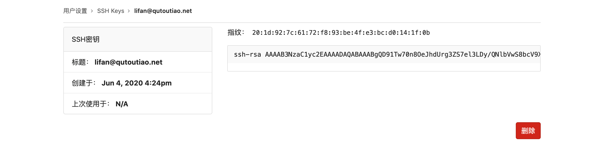

- 克隆项目到本地

```bash
git clone git@git.qutoutiao.net:fe-wailaxin/wlx-agent-admin.git
```

- 切换到项目目录

```bash
cd wlx-agent-admin
```

- 安装 nrm

```bash
sudo npm i -g nrm
```

- 查看目录

```bash
nrm ls
```

- 添加公司内网依赖

```bash
nrm add qtt http://nexus.qutoutiao.net/repository/qtt
```

- 使用内网依赖

```bash
nrm use qtt
```

- 安装公网依赖

```bash
sudo npm i
```

- 变更文件的权限，再次安装依赖

对 chmod 指令的解释参见 [https://www.runoob.com/linux/linux-comm-chmod.html]

```bash
sudo chmod -R 777 node_modules

sudo npm i
```

- 运行项目

```bash
npm run dev
```

- 控制台 Application 添加 Cookies

```bash
Name: token

Value: tmp_zhinengtoufang_1
```

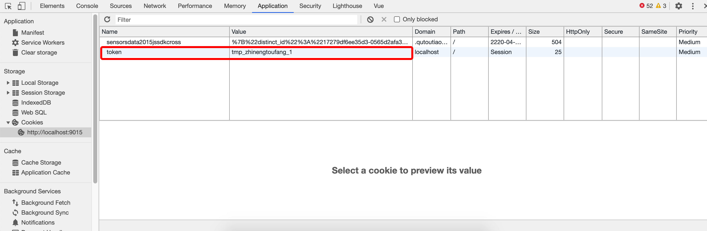

## 6.5

### 研读智能投放项目相关的代码

涉及知识点

- mapState

- v-slot 具名插槽的使用

  ```vue
  <template v-slot: outSelect></template>
  ```

- vuex
  data 的变化： API 接口 -> actions -> mutations -> state

- el-select 基础多选
  - multiple 支持多选
  - clearable 支持可以清空选项
  - size: "small" 输入框尺寸 值有:medium/small/mini

- el-input input 输入框

- el-date-picker 选择日期范围

- el-table el-table-row el-table-column

## 6.8

### 需求1：内部-素材管理页面


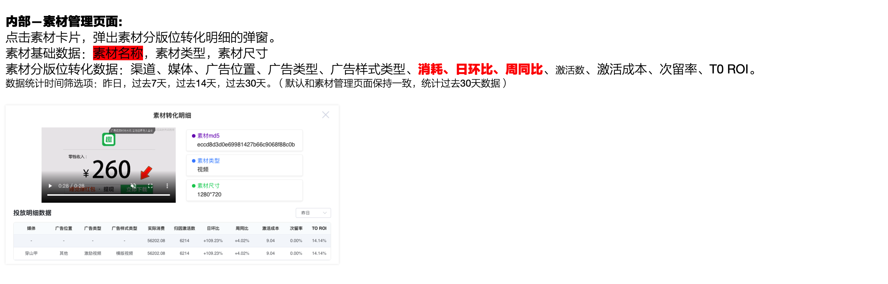

- 需要切换到创意网络分支上开发

  ```bash
  git checkout feature/creative_platform
  ```

## 6.9

### 需求1

需求完成了一小半

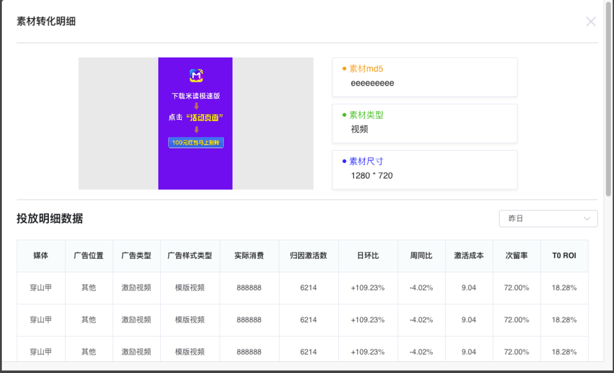

- 主要解决一些报错问题，诸如 Missing prop value...

- 添加了右侧滚动栏，存在的问题：

  - 表格宽度显示 925px，我需要将其设置成 940px 才对，但是不起效果

- 后续自己写了个数据，进行了展示

### 笔记

在本地代码与远程分支的代码有差异的情况下将远程最新代码拉取到本地的步骤：

- git add .
- git stash
- git pull
- git stash pop
- 解决一下冲突的地方

## 6.10

- 昨天遗留的 table 表格宽度问题，发现原因可能出现在外接显示器上，应该是分辨率差异的问题，因为直接在 mac 上显示的是没问题的，940px
- 视频/图片在区域内自适应显示

  ```css
  img {
    max-width: 100%;
    max-height: 100%;
  }

  video {
    display: block;
    width: 100%;
    height: 100%;
  }
  ```

- 修改滚动条不包括 title 部分
- 添加 api 接口，获取接口数据
- 与 UI 商量宽度太大的问题，将宽度由 800px 调整到 600px

今天的效果图：
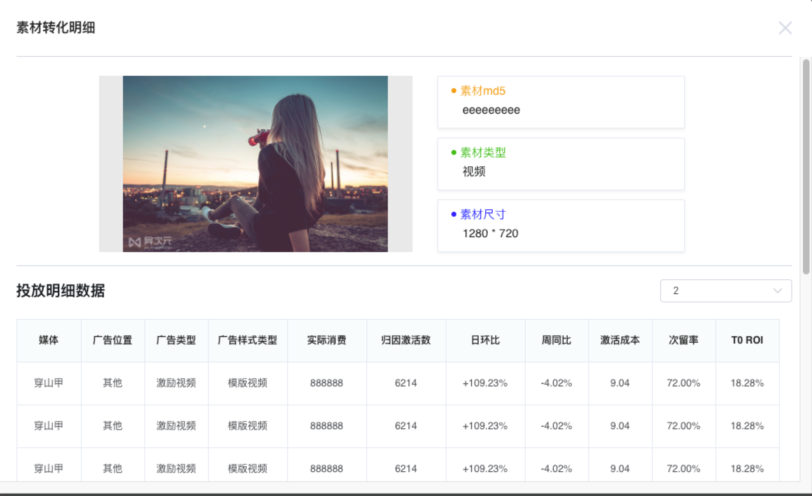

## 6.11

### 调用接口

- 在 src->core->Apis->creativeNetwork.js 文件中 network 对象中添加接口

  ```js
  // 素材管理页面素材详情
  materialDetail: new QukanApiInfo({
    path: "/material/detail",
    type: "post",
    author: "郑飞",
  });
  ```

- 在 src->store->modules->creativeNetwork.js 中请求数据

  - actions 中添加异步请求的函数

    ```js
    // 获取素材管理页面素材详情数据
    async getMaterialDetail({ commit, state }, payload = {}) {
        let info = await quRequest.sendSmf(api.network.materialDetail, payload);
        // console.log('info:', info.data['list']); // Array
        commit('updateMaterialDetail', info.data['list']);
        console.log('info: ', info); //查看info数据
        return info;
    }
    ```

  - mutations 中添加 updateMaterialDetail 方法

    ```js
    // 素材管理页面
    updateMaterialDetail(state, data) {
        // console.log('Mutation - data: ', data); // Array
        state.materialDetail = data;
    }
    ```

  - state 中添加数据

    ```js
    // 素材管理页面数据
    materialDetail: [],
    // 列表求和数据，sum
    materialTableSum: [],
    // select选择器的数据
    materialDateRange: [
        { id: 1, title: '今日' },
        { id: 2, title: '昨日' },
        { id: 3, title: '过去7天' },
        { id: 4, title: '过去14天' },
        { id: 5, title: '过去30天' }
    ]
    ```

成功调用接口，从后端接收数据进行页面渲染

### 遇到的问题6.11

- material_id 在弹框组件上获取不到，找出原因，视频列表组件上没有 material_id，与后端沟通加上了这个字段。

- Popup 组件通过 v-if 来控制显示比较好，通过双向数据绑定的方式出现了组件间传递 material_id 的时候 mounted 钩子函数中已经执行了，而不是等到点击之后再执行。

- select 选择器  切换不同 label 时向后端请求相应的数据，不能通过在 el-option 上添加点击事件，不起作用，而是通过在 el-select 上绑定一个 bindSelect，在 bindSelect 中重新向后端发起请求。

效果：
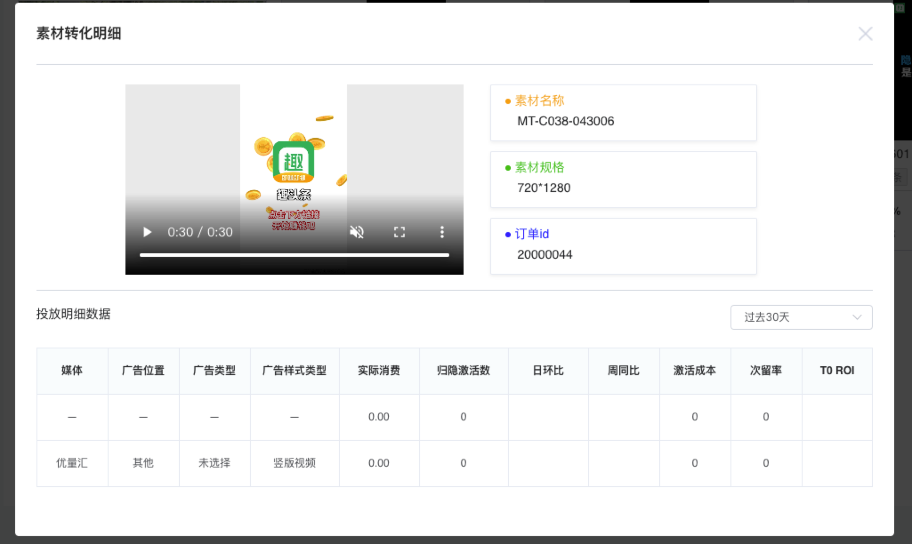

### 遗留问题6.11

在list组件页面点击排序要在谈框组件中也进行排序，也就是点击视频的时候要将排序字段传递给弹框组件，进行排序后渲染

## 6.12

### 排序字段

最终商讨排序交给后端来做，前端排序出了问题没法解决，在点击视频的时候将material_id， statistical_start， statistical_end，order_fields（中放排序字段）一同发给后端，后端返回相应数据进行渲染

### 日环比和周同比样式

要求大于0的要显示红色，小于0的要显示绿色

- 给el-table-column绑定的一个动态的类名 :class-name="showColor"
- 在data中定义一个变量showColor为空，然后定义两个css样式

```css
.showGreen {
    color: #52C41A;
}
.showRed {
    color: #F5222D;
}
```

- 判断日环比和周环比的数据，大于0设置showColor为showRed，小于0设置showColor为showGreen，等于0就设置showColor为空

### 向后端发送请求的方式

在 methods 里

```js
async getDetail() {
    let params = {
        material_id: this.itemDetail.material_id,
        statistical_start: '2020-6-11',
        statistical_end: '2020-6-12',
        order_fields: [] // 排序字段
    };
    let { code, data, message } = await this.getMaterialDetail({ data: JSON.stringify(params) });
    // 容错处理
    if (code) {
        message.error({ message: message });
    }
}
```

### 解决bug

弹框组件的列表详情在组件被点击的时候会又一个闪跳的bug，原因是弹框组件是通过v-if实现的，数据会被缓存在内存中，在切换不同的视频时，会复用内存中的数据，通过在退出弹框组件的时候将列表详情的渲染的数据清空问题得以解决。

### 需求2

在订单数据页面，点击所有筛选按钮后添加新的筛选项：

- 订单数据：渠道、代理、账号、流量媒体、流量性质、广告位置、广告类型、广告样式类型、广告素材尺寸

## 6.15

### 需求2完成

- 对需求2的样式进行排版

- 添加字段：渠道、代理、账号、流量媒体、流量性质、广告位置、广告类型、广告样式类型、广告素材尺寸

- 每个select选择器添加一个全部选择，每个select选择器选择的时候会向后端传递相应字段的内容。添加相应的字段传递给后端，并对其判断，如果全选就传递一个空数组。

  - 例如：选择代理select选择了'智能投放'，会向后端传递`"agent_names": ["智能投放"]` ；选择了全部代理，会向后端传递`"agent_names": []`

- 实现需求2的效果图

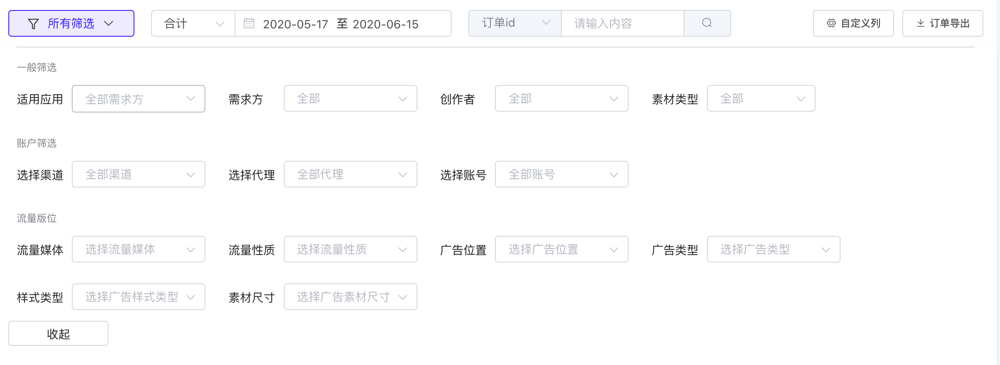

### 遗留问题6.15

将需求2这块儿功能的代码拆分出去，独立成一个组件。

## 6.16

### 完善需求2

将需求2的代码拆分成一个组件orderFilter 单独出去，在父组件里导入这个组件

将请求接口的参数params 放到了creativeNetwork.js 中来写，将原有代码很多保存在data 中的数据重新放到了 state 中去存储。

解决了几个小bug

### 遇到的问题6.16

将代码拆分，修改了夏雨哥定义的方法，影响到了夏雨哥的代码操作，将方法恢复回来

## 6.17

### 解决2个bug

- bug1: 订单管理的适应应用全选不去勾问题

- bug2: 页码选中大于1的数，当点击筛选项时需要更新页码为第一页，每一个筛选都需要应用，内部外部都需要应用

bug1 解决一直失败的原因是第二行_pushArrCal和val指向的是同一块数据，一个变另一个也在变，我们需要的是深拷贝。

```js
if (val.length && val.length !== this.appsDefault.length) {
    let _pushArrCel = [...val]; // 一开始直接写的let _pushArrCel = val;
    if (val[0][0] === -1) {
        _pushArrCel.shift();
    }
    this.appSelectAll = false;
    this.setSearchApp(_pushArrCel);
    this.getData();
}
```

bug2是给分页器添加一个属性

```js
:current-page="materialCurrentPage"
```

在每个筛选项v-model绑定的参数中调用mutations里面的修改页码数的方法

## 6.18

### 修改bug

- bug1:素材管理页面，素材卡片内日环比/周同比上涨应该是红色的，下降应该是绿色的。样式有误
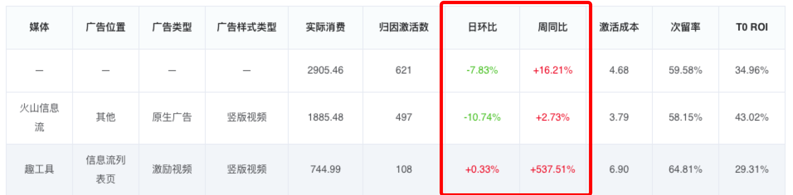

    解决：用过滤器一个过滤器去动态的设置样式

    ```js
    <el-table-column prop="day_consumption" label="日环比" width="90">
        <template slot-scope="scope">
            <span :class="scope.row.day_consumption | chooseColor">
                {{ numberType(scope.row.day_consumption) }}
            </span>
        </template>
    </el-table-column>

    filters: {
        chooseColor(value) {
            if (Number(value) > 0) {
                return 'showRed';
            } else if (Number(value) < 0) {
                return 'showGreen';
            } else {
                return '';
            }
        }
    },

    methods: {
        // 数字加符号和百分号
        numberType(n) {
            if (!n) return '0.00%';
            n = Number(n).toFixed(2);
            let _n = n > 0 ? '+' + n : n;
            let _per = n === 'N/A' ? '' : '%';
            return _n + _per;
        }
    }
    ```

- bug2:外部用户素材管理，千次曝光收益改成CPM
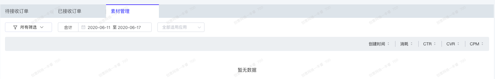
- bug3:素材管理页面次留率 和 T0 ROI 需要带%，除了激活是整数外，其他都显示2位小数
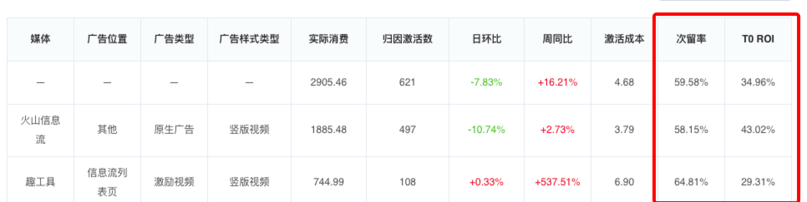
素材详情页面有时候规格不显示
- bug4:订单数据页文案修改：近一周消耗，近一月消耗
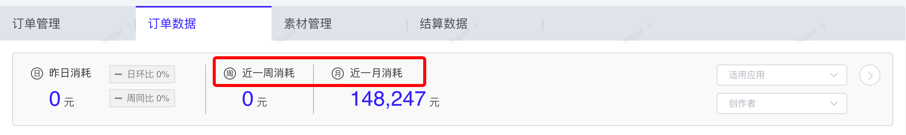
- bug5:素材管理只展示离线数据，明细中去掉今日选项
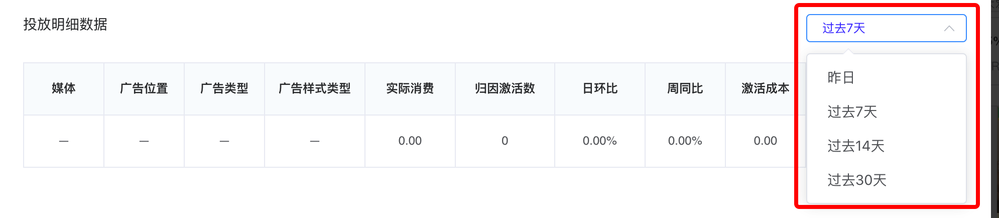
- bug6:结算数据筛选项全部适用应用，当把每个app都选中时，要将全部应用勾选上。当全选和全不选的时候传给后端的字段app_ids必须是空数组。
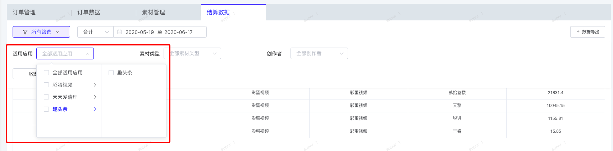
  - 针对全部应用勾选的问题，解决如下：

    ```js
    // orderApp是用来存储级联选择器渲染数据的数据，形式是这样的：[ [-1], [-3, 3], [-31, 31] ]，-1表示包含全部

    // val是用来保存当前页面上已经选中的，形式:[ [-31, 31] ] 表示页面上只选中一个

    // levelApps是接口返回的数据，是不变的，形式是[ { id: -31, name: "QTT", children: [ { id: 31, name: "QTT", children: null } ] } ]

    // levelAppsLen，这个长度定义在组件data中，在methods中定义一个getlevelAppsLen()方法，在init()或者mounted钩子里调用一下这个方法，确保只执行一次，拿到levelApps的中每个成员的children的长度和，留待判断

    // deletOrderApp是定义在mutations里的方法，只在全选状态去掉某一个值的时候被调用
    bindOrderApp: {
        // 内部
        get() {
            return this.orderApp;
        },
        set(val) {
            // 选择之后更改页面为第一页
            this.updateOrderPage(1);

            // confirm 全选选中
            if (!this.appSelectAll && val[0] && val[0][0] === -1) {
                this.appSelectAll = true;
                let _pushArr = [];
                for (let i = 0; i < this.levelApps.length; i++) {
                    if (this.levelApps[i].id === -1) {
                        _pushArr.push([-1]);
                    } else {
                        for (let j = 0; j < this.levelApps[i].children.length; j++) {
                            _pushArr.push([this.levelApps[i].id, this.levelApps[i].children[j].id]);
                        }
                    }
                }
                this.updateOrderApp(_pushArr);
                this.getOrderList();
                return;
            }
            // cancel 全选取消
            if (this.appSelectAll && val[0] && val[0][0] !== -1) {
                this.appSelectAll = false;
                let _pushArrVal = [];
                this.updateOrderApp(_pushArrVal);
                this.getOrderList();
                return;
            }
            // 选中的值等于全选
            if (this.orderApp.length && !this.orderApp[0].includes(-1) && val.length === this.levelAppsLen) {
                let _pushArrAll = [];
                for (let i = 0; i < this.levelApps.length; i++) {
                    if (this.levelApps[i].id === -1) {
                        _pushArrAll.push([-1]);
                    } else {
                        for (let j = 0; j < this.levelApps[i].children.length; j++) {
                            _pushArrAll.push([this.levelApps[i].id, this.levelApps[i].children[j].id]);
                        }
                    }
                }
                this.appSelectAll = true;
                this.updateOrderApp(_pushArrAll);
                this.getOrderList();
                return;
            }
            // 全选状态去掉某一个值
            if (this.orderApp && this.orderApp.length && this.orderApp[0].includes(-1)) {
                // 删掉orderApp里当前选中的值 val
                this.appSelectAll = false;
                this.deletOrderApp(val);
                this.getOrderList();
                return;
            }

            // 上面4种情况都没有走的话，也要确保向后端传递相应的字段app_ids
            this.updateOrderApp(val);
            this.getOrderList();
        }
    }
    ```

  - 针对当全选和全不选的时候传给后端的字段app_ids必须是空数组。解决如下：在传递给后段字段的时候加个判断，若是app_id包含了-1就传空数组即可

    ```js
    { app_ids: this.app_id.includes(-1) ? [] : this.app_id }
    ```

## 6.19

### 创意网络1.5上线

呆到了12点半，中间修改了个bug：素材管理页面的时间不能显示到今天

## 6.22

### 小需求

小需求: 订单数据页面消耗日环比和消耗周同比的数字颜色，正的红色，负的绿色

这边碰到了问题，合计行的消耗日环比和消耗周同比的颜色不生效，这里请求夏雨哥协助，通过element-ui的cell-style表格属性来设置单元格的属性，找到需要进行样式设置的DOM节点，添加类名即可

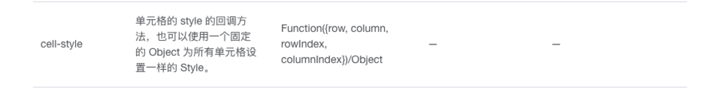

```js
cellStyle({ row, column, rowIndex, columnIndex }) {
    console.log(row, column, rowIndex, columnIndex); // 可以看到column里有个id属性
    let sumDom = document.querySelector('.qgm-table__footer-wrapper').querySelector(`.${column['id']}`) || ''; // 容错处理
    let item = sumDom && sumDom.innerText; // 容错
    // 日环比 周同比 样式区分
    if (
        item &&
        (column['property'] === 'consumption_real_than_yesterday' ||
            column['property'] === 'consumption_real_than_last_week')
    ) {
        sumDom.classList.add(item.indexOf('-') !== -1 ? 'showGreen' : 'showRed');
}
```

至于给列表的每一行消耗日环比和消耗周同比的数字设置样式的方式，我是采用了如下方式：'

```js
<span :class="[scope.row[item.key], item.key] | chooseColor">
    {{ formatFloat(scope.row[item.key]) + % }}
</span>

// 过滤器方法
filter: {
    chooseColor(value) { // 这里的value我是设置了一个数组，数组第一个元素表示数字，数组第二个元素表示字段（consumption_real_than_yesterday / consumption_real_than_last_week）
        if (value[1] === 'consumption_real_than_yesterday' || value[1] === 'consumption_real_than_last_week') {
            if (Number(value[0]) > 0) {
                return 'showRed';
            } else if (Number(value[0]) < 0) {
                return 'showGreen';
            } else {
                return '';
            }
        }
    }
}

```

## 6.23

1. 熟悉投放管家项目的架构以及蓝湖UI稿
2. 开发stewardSearch公共组件，初步完成排版和样式的调整

    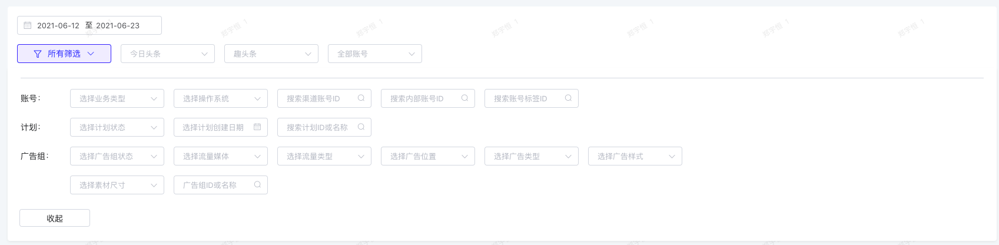
    存在的问题，筛选展开项第三行需要自适应不同宽度的屏幕，待解决

## 6.24

完成account.vue的列表详情内容

## 6.28

### localStorage用法

```js
localStorage.setItem('myCat', 'Tom');

let cat = localStorage.getItem('myCat');
console.log(cat); // Tom
```

可以在控制台Application中查看到保存在localStorage中的键值对
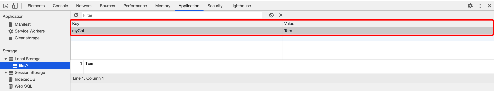

- localStorage 中的键值对总是以字符串的形式存储。(需要注意, 和js对象相比, 键值对总是以字符串的形式存储意味着数值类型会自动转化为字符串类型).

## 6.29

投放管家：

- 账号栏为数字每三位添加逗号
- 计划栏数值筛选中动态添加条件
- 计划栏批量操作禁止的样式
- 计划栏表格详情开发

## 6.30

### 投放管家项目：完成页面的重构

- 完成了批量操作状态（启动 暂停 删除）弹框的开发
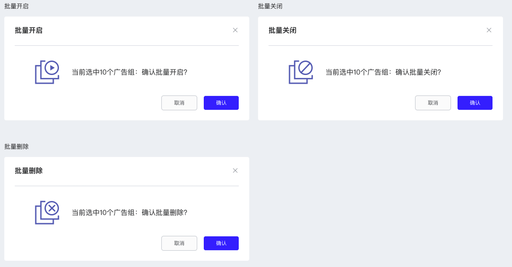

- 完成了批量操作修改日预算的弹框的开发


- 完成了批量操作修改年龄的弹框的开发
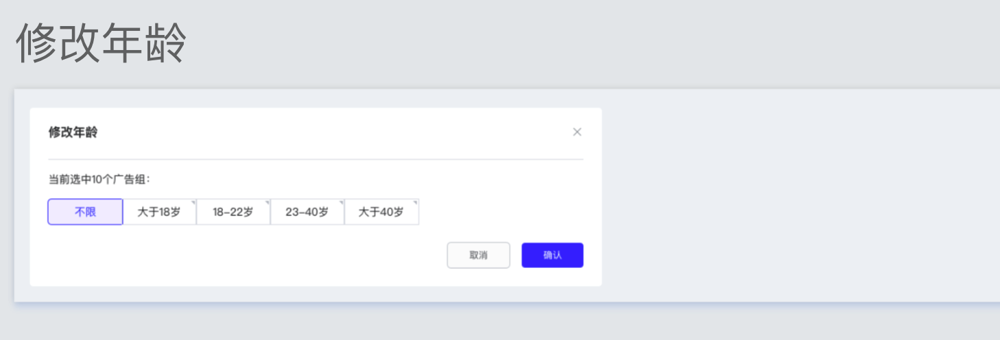

- 完成了批量操作修改系统版本的弹框的开发
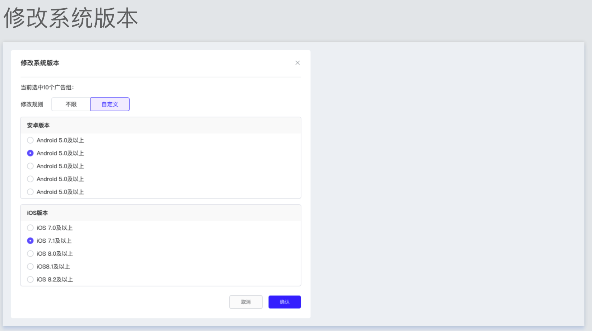

- 完成了批量操作修改人群包的弹框的开发
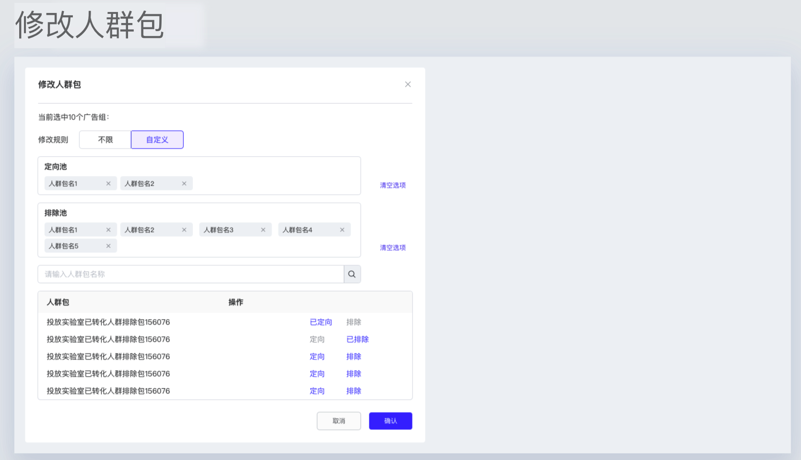

- 完成了批量操作修改试玩素材的弹框的开发
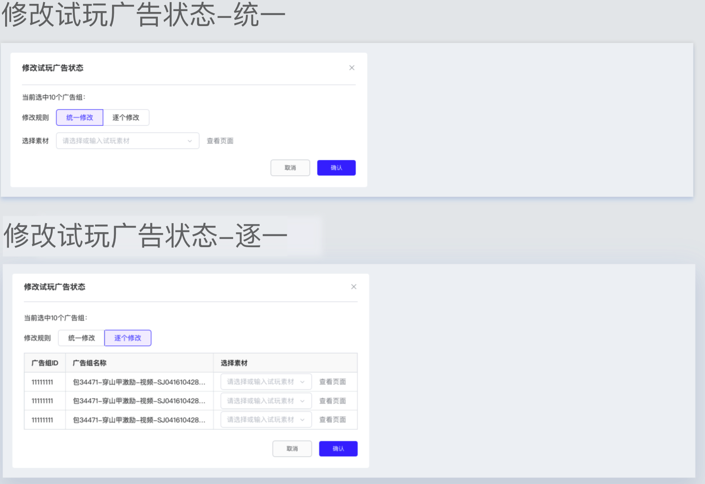

### 总结

- 不要将所有的页面写在一个文件中，就如这个弹框组件，每一个弹框就是一个组件
- 不要急着下手开发，先理清逻辑，想好处理的方式，会节省很大的开发时间，毕竟删代码也是要时间的（来自夏雨哥）

## 7.1

### vuex state 数据构造

```js
state: {
        platform: 'toutiao', // 渠道，总共4个: toutiao gdt kuaishou cpc

        status: { // 状态模块，这里写好了单独的一个简单组件，就不需要导组件了
            start: {
                name: '启动',
                title: '批量启动',
            },
            close: {
                name: '暂停',
                title: '批量关闭',
            },
            del: {
                name: '删除',
                title: '批量删除',
            }
        },
        directionModule: { // 定向模块，用一个总的组件（popup.direction.vue）来切换对应的谈框组件
            bid: {
                name: '修改出价',
                title: '修改出价',
                component: () => import('@/views/intelligent/steward/components/popup.direction.bid')
            },
            budget: {
                name: '修改预算',
                title: '修改日预算',
                component: () => import('@/views/intelligent/steward/components/popup.direction.budget')
            },
            time: {
                name: '修改时段',
                title: '修改时段',
                component: () => import('@/views/intelligent/steward/components/popup.direction.time')
            },
            age: {
                name: ' 年龄',
                title: '修改年龄',
                component: () => import('@/views/intelligent/steward/components/popup.direction.age')
            },
            area: {
                name: ' 地域',
                title: '修改地域',
                component: () => import('@/views/intelligent/steward/components/popup.direction.area')
            },
            people: {
                name: '人群包',
                title: '修改人群包',
                component: () => import('@/views/intelligent/steward/components/popup.direction.people')
            },
            flow: {
                name: '流量包',
                title: '修改流量包',
                component: () => import('@/views/intelligent/steward/components/popup.direction.flow')
            },
            version: {
                name: ' 系统版本',
                title: '修改系统版本',
                component: () => import('@/views/intelligent/steward/components/popup.direction.version')
            },
            playable: {
                name: '修改试玩素材',
                title: '修改试玩素材',
                component: () => import('@/views/intelligent/steward/components/popup.direction.playable')
            }
        },
        ctrl: { // 这样设计可扩展性非常高，增加了disabled属性方便后续维护，
            toutiao: [
                {
                    categoryName: '状态',
                    categoryKey: 'status',
                    children: [
                        { key: 'start', disabled: false },
                        { key: 'close', disabled: false },
                        { key: 'del', disabled: false }
                    ]
                },
                {
                    categoryName: '出价和预算',
                    categoryKey: 'bidBudget',
                    children: [
                        { key: 'bid', disabled: false },
                        { key: 'budget', disabled: false },
                        { key: 'time', disabled: false }
                    ]
                },
                {
                    categoryName: '定向',
                    categoryKey: 'direction',
                    children: [
                        { key: 'age', disabled: false },
                        { key: 'area', disabled: false },
                        { key: 'people', disabled: false },
                        { key: 'flow', disabled: false },
                        { key: 'version', disabled: false }
                    ]
                },
                {
                    categoryName: '创意',
                    categoryKey: 'creative',
                    children: [
                        { key: 'playable', disabled: false }
                    ]
                }
            ],
            gdt: {
                status: [
                    { key: 'start', disabled: false },
                    { key: 'close', disabled: false },
                    { key: 'del', disabled: false }
                ],
                bidBudget: [
                    { key: 'bid', disabled: false },
                    { key: 'budget', disabled: false },
                    { key: 'time', disabled: false }
                ],
                direction: [
                    { key: 'age', disabled: false },
                    { key: 'area', disabled: false },
                    { key: 'people', disabled: false },
                    { key: 'flow', disabled: false },
                    { key: 'version', disabled: false }
                ],
                creative: [
                    { key: 'playable', disabled: true } // true
                ]
            },
            kuaishou: {
                status: [
                    { key: 'start', disabled: false },
                    { key: 'close', disabled: false },
                    { key: 'del', disabled: false }
                ],
                bidBudget: [
                    { key: 'bid', disabled: false },
                    { key: 'budget', disabled: false },
                    { key: 'time', disabled: false }
                ],
                direction: [
                    { key: 'age', disabled: false },
                    { key: 'area', disabled: false },
                    { key: 'people', disabled: false },
                    { key: 'flow', disabled: false },
                    { key: 'version', disabled: false }
                ],
                creative: [
                    { key: 'playable', disabled: true } // true
                ]
            },
            cpc: {
                status: [
                    { key: 'start', disabled: false },
                    { key: 'close', disabled: false },
                    { key: 'del', disabled: false }
                ],
                bidBudget: [
                    { key: 'bid', disabled: false },
                    { key: 'budget', disabled: true }, // true
                    { key: 'time', disabled: false }
                ],
                direction: [
                    { key: 'age', disabled: false },
                    { key: 'area', disabled: false },
                    { key: 'people', disabled: false },
                    { key: 'flow', disabled: false },
                    { key: 'version', disabled: false }
                ],
                creative: [
                    { key: 'playable', disabled: true } // true
                ]
            }
        }
    },
```

### 关键逻辑梳理 批量操作

将批量操作拉出去单独成一个组件，这个操作很关键，因为批量操作涉及到的逻辑交互非常多

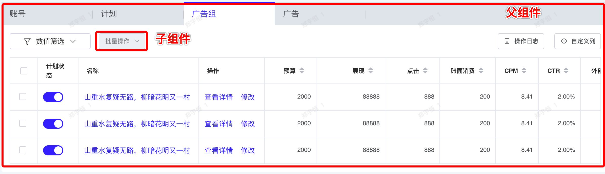

批量操作弹框与按钮栏是一个父子组件的关系，批量操作弹框是子组件，按钮栏(或者说是整个list组件)是父组件，父组件会将adgroupIds传给子组件，然后还有具体的披露操作（启动，暂停，删除，修改出价，修改预算，修改时段，年龄，地域，人群包，流量包，系统版本，修改试玩素材  每一个都是一个弹框组件）的弹框组件（popup.direction.vue 和 popup.status.vue），这个组件与批量操作弹框组件是一个平级的关系，关系图如下

```js
                        list组件（父）
    批量操作弹框组建（子1）               批量操作的具体弹框组件（子2）
```

涉及到的逻辑：**子1**点击之后会将点击的批量操作字段名传给**父**，**父**再将批量操作字段名和adgroupIds（这是表格选中的状态的id，是一个数组）传递给**子2**，**子2**操作之后会继续传相应的内容给**父**。

### 结构开发

- 批量操作组件（ctrl）代码优化

- 完成了批量操作修改出价的弹框的开发
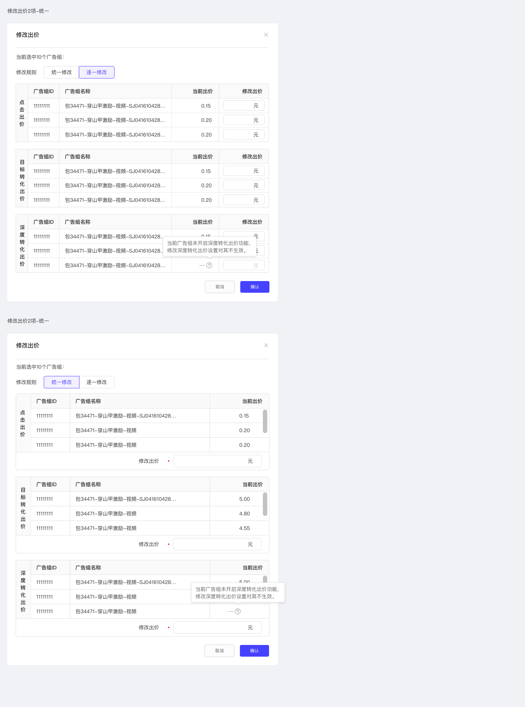

- 完成了批量操作修改时段的弹框的开发
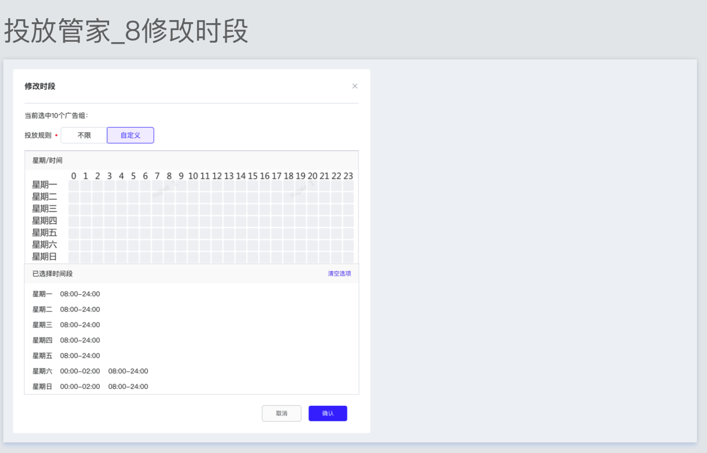

- 完成了批量操作修改地域的弹框的开发
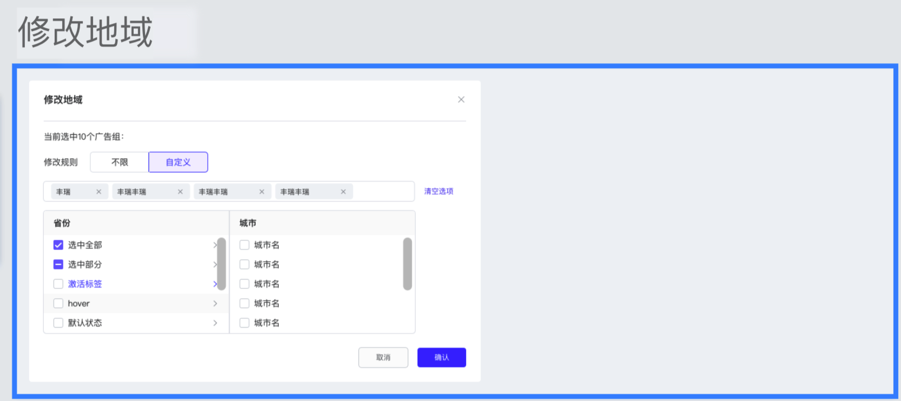

## 7.2

### 通用列表学习

夏雨哥带我写了一遍通用的列表布局样式开发，适用所有的需求表格，布局样式不重要，重要的是这个过程的思维与方式。

```html
<div class="table pl35">
    <!-- table category -->
    <div class="table_category"><div class="txt">点击出价</div></div>
    <!-- table header -->
    <div class="table_hd">
        <div class="table_cell w-15 fb">广告组ID</div>
        <div class="table_cell w-60 fb">广告组名称</div>
        <div class="table_cell w-25 fb tr">当前出价</div>
    </div>
    <!-- table body -->
    <div class="table_bd h100">
        <div class="row">
            <div class="table_cell w-15">11111111111</div>
            <div class="table_cell w-60">广告组名称名称名称</div>
            <div class="table_cell w-25 tr">0.9</div>
        </div>
        <div class="row">
            <div class="table_cell w-15">11111111111</div>
            <div class="table_cell w-60">广告组名称名称名称</div>
            <div class="table_cell w-25 tr">0.9</div>
        </div>
        <div class="row">
            <div class="table_cell w-15">11111111111</div>
            <div class="table_cell w-60">广告组名称名称名称</div>
            <div class="table_cell w-25 tr">0.9</div>
        </div>
        <div class="row">
            <div class="table_cell w-15">11111111111</div>
            <div class="table_cell w-60">广告组名称名称名称</div>
            <div class="table_cell w-25 tr">0.9</div>
        </div>
    </div>
</div>
<div class="table-footer">修改出价:</div>
```

```less
// width %
.loop(@count) when (@count >= 5) {
    .w-@{count}{
        width: (@count) * 1%;
    }
    .loop((@count - 5));
}
.loop(80);

// width px
.generate-columns(800);
.generate-columns(@n, @i: 100) when (@i =< @n) {
  .w@{i} {
    width: (@i * 1px);
  }
  .generate-columns(@n, (@i + 100));
}

// height px
.generate-columns(800);

.generate-columns(@n, @i: 100) when (@i =< @n) {
  .h@{i} {
    height: (@i * 1px);
  }
  .generate-columns(@n, (@i + 100));
}

.table {
    position: relative;
    border: 1px solid #dcdfe6;
    margin-bottom: 0;
    // 无边框
    &.nb{& .table_cell{border: none;}}
    // 圆角
    &.br{
        border-radius: 4px;
        & .table_category{
            border-top-left-radius: 4px;
            border-bottom-left-radius: 4px;
        }
        & .table_hd{border-top-right-radius: 4px;}
        & .table_bd{border-bottom-right-radius: 4px;}
    }
    // 圆角-顶部
    &.brt{
        border-top-left-radius: 4px;
        border-top-right-radius: 4px;
        & .table_category{border-top-left-radius: 4px;}
        & .table_hd{border-top-right-radius: 4px;}
    }

    // table category
    & .table_category{
        position: absolute;
        left: 0;
        top: 0;
        width: 35px;
        height: 100%;
        display: flex;
        justify-content: center;
        align-items: center;
        background: #f9f9fb;
        border-right: 1px solid #dcdfe6;
        z-index: 10;
        & .txt{
            width: 10px;
            line-height: 18px;
            font-size: 12px;
            font-weight: bold;
            color: #333;
        }
    }

    // table单元格
    & .table_cell {
        position: relative;
        padding: 0 15px;
        overflow: hidden;
        white-space: nowrap;
        text-overflow: ellipsis;
        border-right: 1px solid #dcdfe6;
        &:last-child{border-right: none;}
    }

    // table header
    & .table_hd {
        display: flex;
        justify-content: space-between;
        align-items: center;
        height: 40px;
        line-height: 40px;
        background: #f9f9fb;
        border-bottom: 1px solid #dcdfe6;
    }

    // table body
    & .table_bd {
        position: relative;
        background: #fff;
        font-size: 14px;
        font-family: PingFangSC-Regular,PingFang SC;
        font-weight: 400;
        color: rgba(48,49,51,1);
        overflow-y: auto;
        & .row {
            position: relative;
            display: flex;
            justify-content: space-between;
            align-items: center;
            color: #666;
            font-size: 14px;
            line-height: 35px;
            border-bottom: 1px solid #dcdfe6;
            &:last-child{border-bottom: none;}
            &:hover{background: #f9f9f9;}
            & .table_cell {
                position: relative;
                overflow: hidden;
                white-space: nowrap;
                text-overflow: ellipsis;
            }
        }
    }
}
.table-footer{
    padding: 10px 15px;
    line-height: 25px;
    text-align: right;
    border: 1px solid #dcdfe6;
    border-top: none;
    border-bottom-left-radius: 4px;
    border-bottom-right-radius: 4px;
}
```

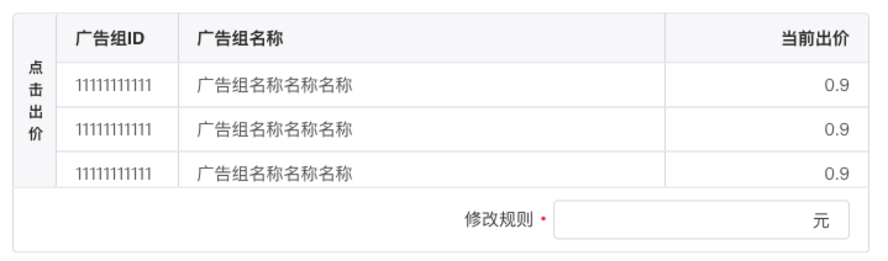

- 可支持圆角，直角（默认直角）
- 支持左边固定栏，右边可滚动

### 弹窗重构

- 都用通用的表格对弹窗中所有的表格进行重构
- 修改地域弹窗中穿梭框的开发
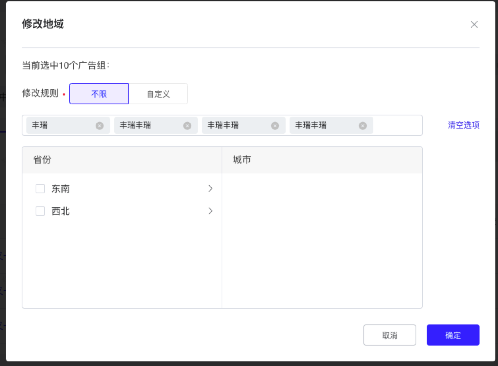

## 7.3

### 列表头功能开发

- 不同组件显示不同的tab栏内容
- 只有选择了渠道后才有数据，否则默认显示没有数据

### 解决组件timerPicker不完全生效 bug

找到修改时间时间选择失败的原因：因为弹窗组件我是使用了`transform: translate(-50%, -50%);`，会改变坐标轴，而时间选择器组件是根据父级坐标系来确定的，因而影响到了

## 7.6

### 开发

当没有选择渠道和App的时候，列表不显示，显示出提示文字：“请选择渠道和App”

### 数据联调

1. 请选择App选择器数据联调

2. search组件中数据联调：（所有筛选项展开项中的select选择器）

   - 选择计划状态
   - 选择广告组状态
   - 选择流量媒体
   - 选择流量类型
   - 选择广告位置
   - 选择广告类型
   - 选择广告样式
   - 选择素材尺寸

### 问题

在独自进行数据联调的时候，缺乏经验，没有加上不同的环境，做的配置如下：

```js
// 文件位置
- src
  - common
    - js
      - constant.js


// 因为是一个新项目，所以需要配置新的域名
STEWARD: {
    API: {
        QA: '//test-corp-api-davinci-tfgj.qttcs3.cn',   // 测试环境域名
        PRE: '//pre-corp-api-davinci.007growth.com',    // 预发环境域名
        PRD: '//corp-api-davinci.007growth.com'         // 线上环境域名
    }
}
```

```js
// 文件位置
- src
  - common
    - js
      - env.js


static stewardDomain() {
        let d = {
            development: CONSTANT.STEWARD.API.QA,
            preview: CONSTANT.STEWARD.API.PRE,
            prd: CONSTANT.STEWARD.API.PRD
        };
        // eslint-disable-next-line no-undef
        return d[CODE_EVN] || d['prd'];
    }

```

```js
// 文件位置
- src
  - core
    - Quequest.js

// 智能投放管家(golang服务)
sendSteward(api, data = {}) {
    let url = ENV.stewardDomain() + api.path;
    // 将当前页面路由添加入headers
    api = new QukanApiInfo(api);
    api.headers = {
        'Content-Type': 'application/json;charset=UTF-8'
    };
    return this.nativeSend(
        {
            key: api._path,
            url: url,
            type: api.type,
            timeout: api.timeout,
            headers: api.headers,
            author: api._author || '',
            project: api.project
        },
        data
    ).catch(err => {
        return err;
    });
}

```

配置完就继续在Apis/intelligent.js下的添加需要的接口，然后在vuex Actions里调用异步的方法

## 7.7

### 所有筛选-数据联调

完成剩余的所有筛选展开项中的筛选项的数据联调

- 选择业务类型，前端写死
- 选择操作系统，前端些死
- 搜索渠道账号ID
- 搜索内部账号ID
- 搜索账号标签ID
- 搜索计划ID或名称
- 选择计划创建日期（与产品沟通进行了修改）

### 数值筛选-数据联调

campaign和adgroup中的数值筛选项的数据联调

- 请选择筛选指标
- 关系符，前端写死

### 遗留问题

数值筛选-数据联调中的多个条件的值一起变动，需要用列表存储每个条件的指标，关系符以及input值

## 7.8

- 数值筛选项问题解决
- 所有筛选项中的计划创建时间修改调整

## 7.9

- adgroup查看详情的[chart](https://g2.antv.vision/zh/examples/line/basic#curved)开发

## 7.10

- 批量操作修改时段深入开发
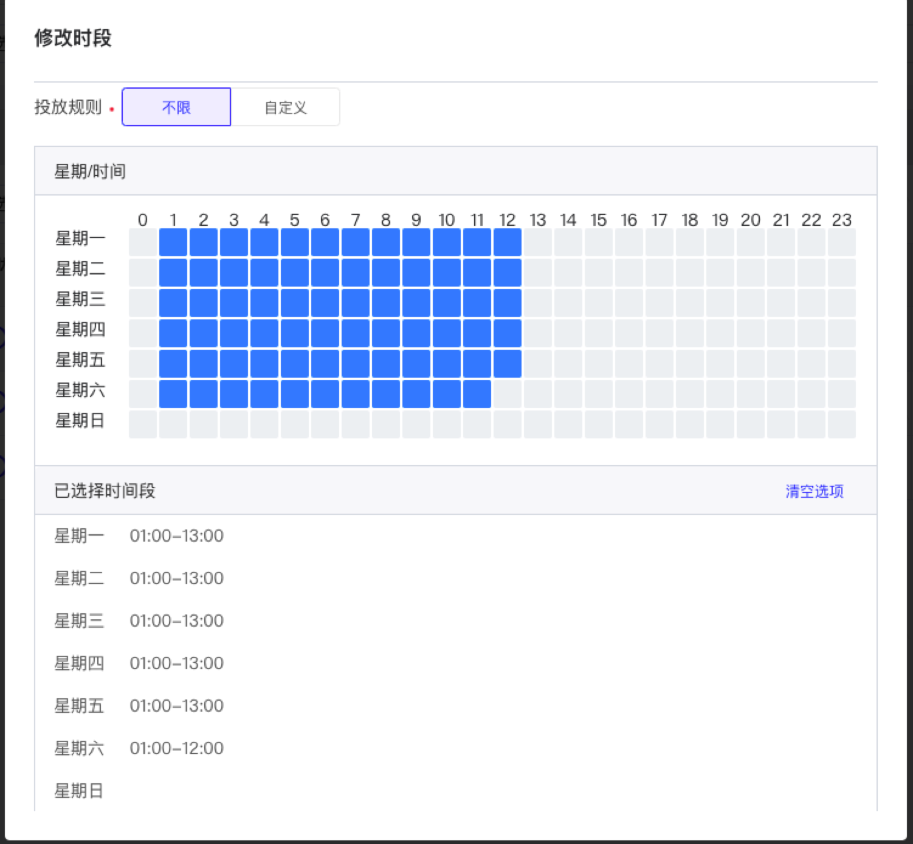
- adgroup修改操作的快捷键（点击修改，选中这行复选框，并展开批量操作下拉菜单）

## 7.12

加班开发中～

## 7.13 - 7.15

投放管家项目疯狂联调中，累累累！！！

## 7.16

项目优化

- 所有筛选项展开中 计划ID或名称/广告组ID或名称 支持逗号（中英文均可）分隔搜索

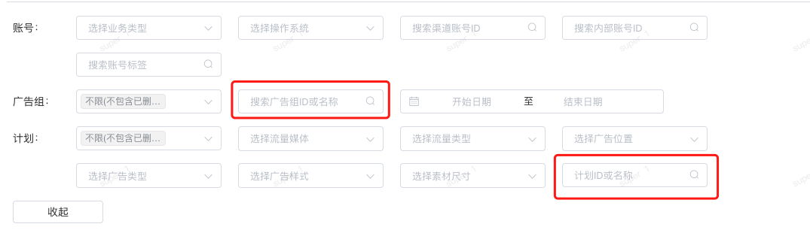

- 查看详情里渠道、产品名称、投放账号的映射

- 数值筛选 文本框非法字符输入校验且支持浮点数，修复当删除某个条件时收起再展开后，之前删除的条件又恢复了

## 7.17

### bug修复

- campaign adgroup滑块控制 需要掉接口（启动/暂停）
- campaign 和 adgroup里
    adgroup_id: "NOT_ATT"
    campaign_id: "NOT_ATT"
    这两个也是禁用的
- 底边框缺失
    逐一修改 修改出价 元 要放到文本框里面，还有个问号的要添加一下，tips

## 7.20

### bug修复

- 数值筛选完善：
  - 点击添加的时候增加校验
  - 点击删除的时候发送通知，如果只有一项点击删除的时候是起清空的作用
  - 在切换platform的时候将保存在 vuex 里的数值筛选的 campaignFilter 和 adgroupFilter 清空

- 批量操作点击空白处收起

    ```js
    // 在点击的时候加入 .stop 事件修饰符（阻止单机事件继续传播）
    <el-button
        plain
        size="small"
        :class="isDisabled"
        title="请先选择操作对象"
        @click.stop="handleBtnClick"
    >
        批量操作
        <i class="el-icon-arrow-down el-icon--right"></i>
    </el-button>


    // 在弹窗组件mounted里添加监听事件，并在
    methods: {
        handleCloseCtrlMenu() {
            this.$emit('update:menuShow', false);
        }
    },
    mounted() {
        window.addEventListener('click', this.handleCloseCtrlMenu);
    },
    destroyed() {
        window.removeEventListener('click', this.handleCloseCtrlMenu);
    }
    ```

- adgroup查看详情
    调用分日接口的时候，start_date，end_date是当前日期往前推7天
    调用分时接口的时候，start_date，end_date是当前日期

## 7.21

### 投放管家cpc渠道开发

- 修改出价

## 7.22

### 投放管家cpc渠道开发

- 修改时段
  cpc 传递的参数的格式：
  "schedule_time": "16777088,16777088,16777088,16777088,16777088,16777088,16777088"
- 修改预算

## 7.23

### 投放管家cpc渠道开发 bug修复

- [x] 修改出价接口number类型不匹配，报错，修复
- [x] 修改预算类似
- [x] adgroup滑块切换掉接口没有传params
- [x] adgroup查看详情视频/图片预览样式修改

## 7.24

### 投放管家cpc渠道开发 bug修复

- [x] 修改出价文案错误
- [x] 自定义投放时段、取消、确认按钮显示不全

## 7.27

### 投放管家cpc渠道开发 bug修复

- [x] 批量开启单元，后台成功、前端开关按钮没变化 原因是缺少了修改广告组状态掉借口的时候没有传递campaign_id（yapi上没写）
- [x] campaign adgroup 滑块点击失败问题 原因是actions方法里返回的是data，并没有code，所以一直失败
- [x] 批量操作单个的时候要给其设置默认值，解决选择单个是修改时段的默认显示问题

## 7.28

### 投放管家cpc渠道开发 代码优化

- [x] 优化修改时段单个操作默认显示的代码优化
- [x] 为单个批量操作 添加loading，修改loading的css样式
- [x] adgroupDetail图表加百分号

## 7.29

### 投放管家cpc渠道开发 bug修复

- [x] account campaign adgroup 3个列表页的中文都靠左对齐，数字都靠右对齐
- [x] 操作日志固定头部滚动，原生elementUI叫做流体高度，只需设置max-height为Table指定最大高度
- [x] 数值筛选项按钮（查询）样式修改，筛选项与时间联动，比如跨天的时候是筛选指标是不应该出现 日预算/实时次留率/实时预估ROI

### 智能投放cpc渠道上线

上线之后产品提出建议：windows的电脑，滚动条可以放在表头的下方么，现在需要滑到最下面，才能向右移动看更多的字段

## 7.30

智能投放cpc渠道 列表滚动条优化，将el-table全部改成用qgm-table

## 7.31

智能投放cpc渠道列表合计行需求开发上线

## 8.3-8.7

【智能投放】-【投放平台V3.2】投放管家一期问题修复与功能优化

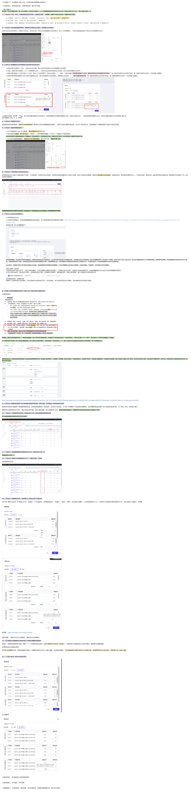
