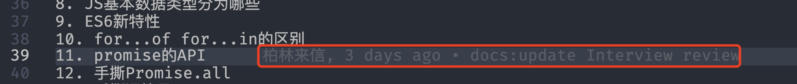
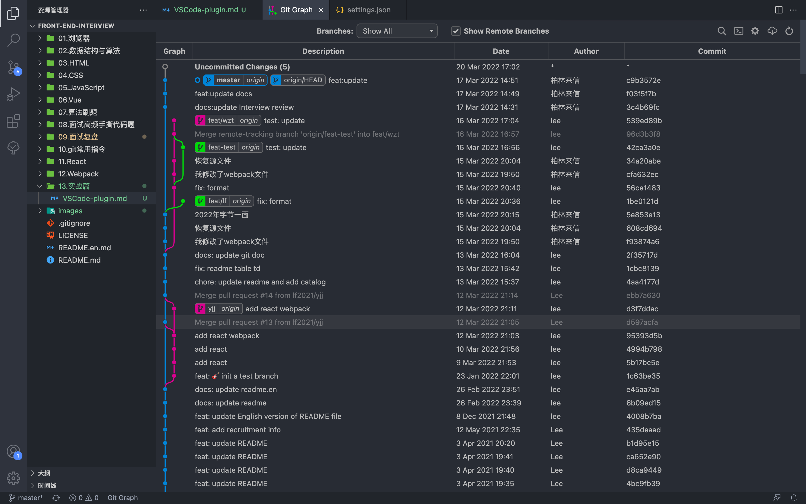
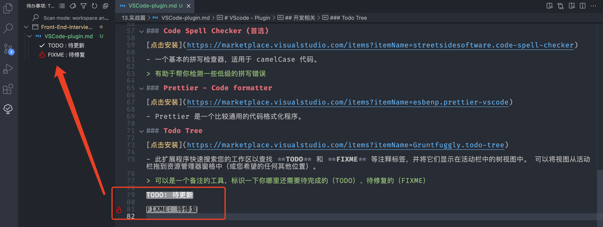

# VScode - Plugin

- [VScode - Plugin](#vscode---plugin)
  - [vscode 配置相关](#vscode-配置相关)
    - [Chinese (Simplified) (简体中文) Language Pack for Visual Studio Code](#chinese-simplified-简体中文-language-pack-for-visual-studio-code)
    - [Material Icon Theme](#material-icon-theme)
    - [One Monokai Theme](#one-monokai-theme)
  - [Git 相关](#git-相关)
    - [GitLens](#gitlens)
    - [Git Graph](#git-graph)
  - [Markdown 相关](#markdown-相关)
    - [MarkdownLint](#markdownlint)
    - [Markdown All in One](#markdown-all-in-one)
  - [开发相关](#开发相关)
    - [Code Spell Checker (首选)](#code-spell-checker-首选)
    - [Prettier - Code formatter](#prettier---code-formatter)
    - [Todo Tree](#todo-tree)
    - [Path Intellisense](#path-intellisense)
    - [image preview](#image-preview)
    - [SVG Viewer](#svg-viewer)

## vscode 配置相关

### Chinese (Simplified) (简体中文) Language Pack for Visual Studio Code

[点击安装](https://marketplace.visualstudio.com/items?itemName=MS-CEINTL.vscode-language-pack-zh-hans)

- VScode 默认是英文版，使用此插件可以改成中文版

### Material Icon Theme

[点击安装](https://marketplace.visualstudio.com/items?itemName=PKief.material-icon-theme)

- 定制化你的 vscode 目录主题，丰富的素材图标。

### One Monokai Theme

[点击安装](https://marketplace.visualstudio.com/items?itemName=azemoh.one-monokai)

- 一款暗黑色的主题选择，融合了 Monokai 和 One Dark 主题

## Git 相关

### GitLens

[点击安装](https://marketplace.visualstudio.com/items?itemName=eamodio.gitlens)

- 可以一眼看到这段代码是谁提交的，或者这段代码最新的修改者是谁

### Git Graph

[点击安装](https://marketplace.visualstudio.com/items?itemName=mhutchie.git-graph)

- 查看项目的 Git 图表，并从图表轻松的执行 Git 操作。

## Markdown 相关

### MarkdownLint

[点击安装](https://marketplace.visualstudio.com/items?itemName=DavidAnson.vscode-markdownlint)

- markdown 语法规范检测

### Markdown All in One

[点击安装](https://marketplace.visualstudio.com/items?itemName=yzhang.markdown-all-in-one)

- Markdown 所需的一切（键盘快捷键、目录、自动预览等）。

> 支持一键生成目录，具体参考: <https://lf2021.github.io/2020/07/04/github%E7%9B%AE%E5%BD%95%E9%97%AE%E9%A2%98/>

## 开发相关

### Code Spell Checker (首选)

[点击安装](https://marketplace.visualstudio.com/items?itemName=streetsidesoftware.code-spell-checker)

- 一个基本的拼写检查器，适用于 camelCase 代码。

> 有助于帮你检测一些低级的拼写错误

### Prettier - Code formatter

[点击安装](https://marketplace.visualstudio.com/items?itemName=esbenp.prettier-vscode)

- Prettier 是一个比较通用的代码格式化程序。

### Todo Tree

[点击安装](https://marketplace.visualstudio.com/items?itemName=Gruntfuggly.todo-tree)

- 此扩展程序快速搜索您的工作区以查找 **TODO** 和 **FIXME** 等注释标签，并将它们显示在活动栏中的树视图中。 可以将视图从活动栏拖到资源管理器窗格中（或您希望的任何其他位置）。

> 可以是一个备注的工具，标识一下你哪里还需要待完成的（TODO）、待修复的（FIXME）

### Path Intellisense

[点击安装](https://marketplace.visualstudio.com/items?itemName=christian-kohler.path-intellisense)

> 自动补全文件名，路径名

### image preview

[点击安装](https://marketplace.visualstudio.com/items?itemName=kisstkondoros.vscode-gutter-preview)

> 顾名思义，支持在 hover 的时候预览图片

### SVG Viewer

[点击安装](https://marketplace.visualstudio.com/items?itemName=cssho.vscode-svgviewer)

> 支持 SVG 预览

TODO: 待更新
