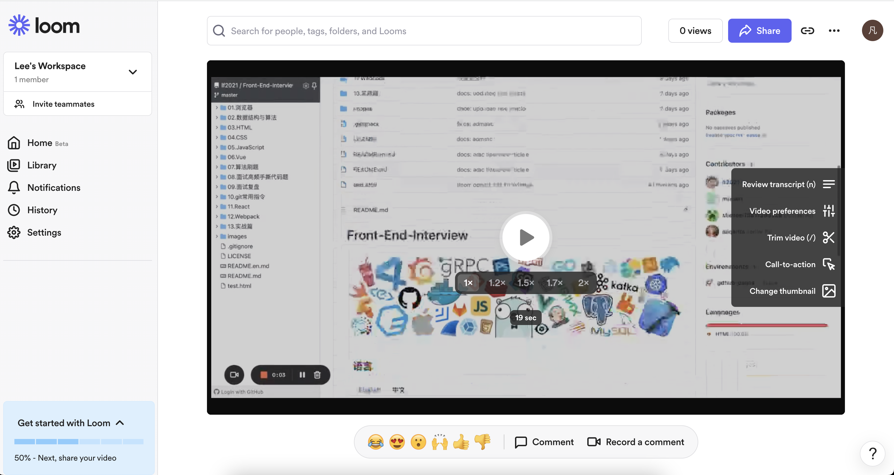
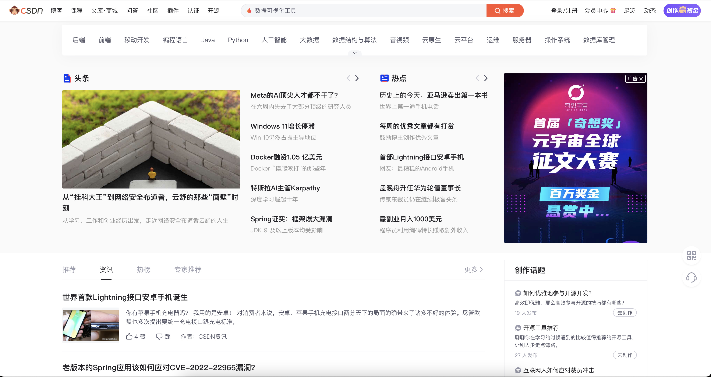
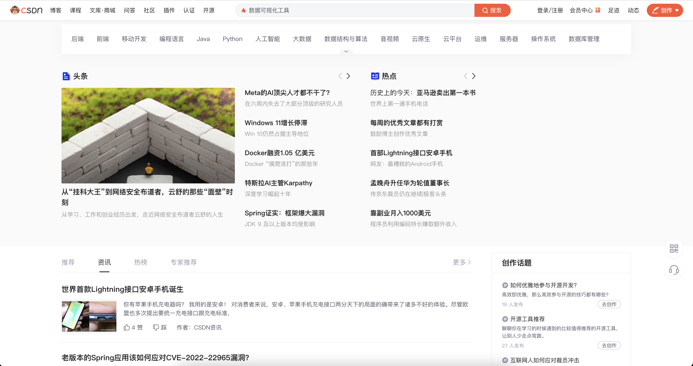
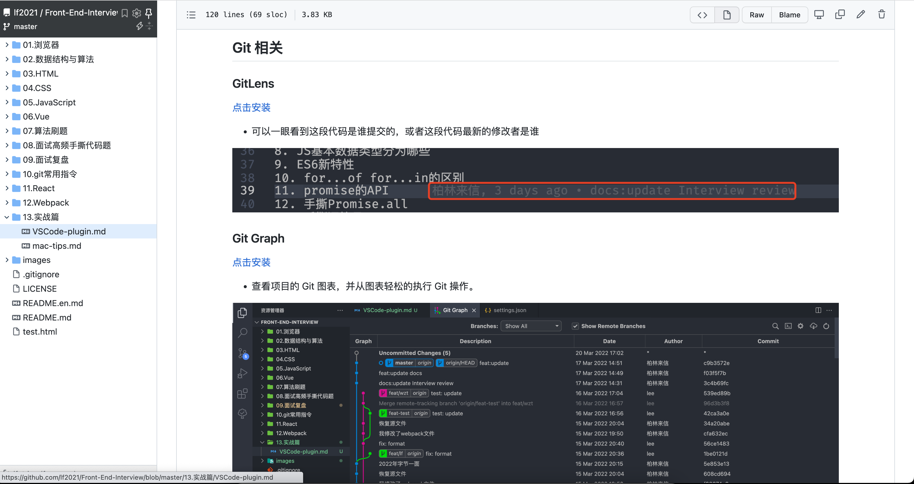
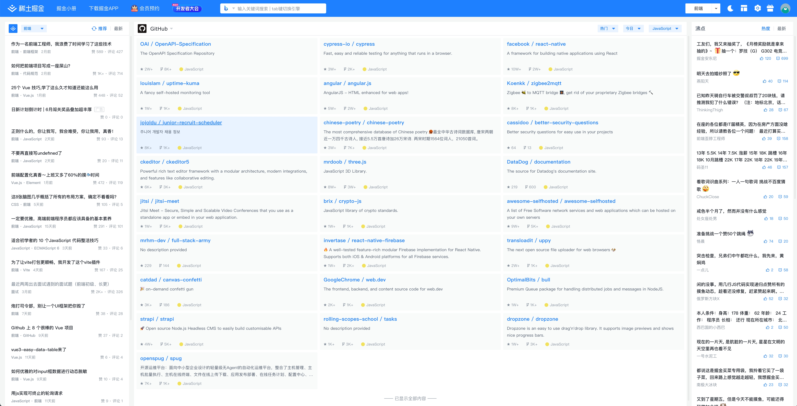

# Chrome - Plugin

看到一个开源项目维护了 Chrome 插件英雄榜，引流推荐一波
https://github.com/zhaoolee/ChromeAppHeroes

- [Chrome - Plugin](#chrome---plugin)
  - [录屏 Loom 🌟🌟🌟🌟](#录屏-loom-)
  - [AdBlocker 插件 🌟🌟🌟🌟](#adblocker-插件-)
  - [Octotree - GitHub code tree 🌟🌟🌟](#octotree---github-code-tree-)
  - [FEHelper（前端助手）🌟🌟🌟🌟](#fehelper前端助手)
  - [Omni 🌟🌟🌟](#omni-)
  - [稀土掘金 🌟🌟🌟](#稀土掘金-)

## 录屏 Loom 🌟🌟🌟🌟

[安装](https://chrome.google.com/webstore/detail/loom-%E2%80%93-free-screen-and-ca/liecbddmkiiihnedobmlmillhodjkdmb?hl=en)

> 这是一款支持录屏的插件，录好的屏会生成一个链接，可以自由的分享，非常方便。
>
> 这是我录制的一个视频链接: https://www.loom.com/share/75c6f6f9d40b4c99a5e13aec9f174601

## AdBlocker 插件 🌟🌟🌟🌟

这类插件的需求大家也都理解，对于某些网页上的广告实在是忍无可忍，这里我推荐两个

- [AdGuard AdBlocker](https://chrome.google.com/webstore/detail/adguard-adblocker/bgnkhhnnamicmpeenaelnjfhikgbkllg?hl=en)
- [AdBlock](https://chrome.google.com/webstore/detail/adblock-%E2%80%94-best-ad-blocker/gighmmpiobklfepjocnamgkkbiglidom?hl=en)

效果拿 CSDN 首页来说

|  |  |
| :------------------------------------------------: | :---------------------------------------------: |

当然大家要理解网页上的广告行为，维护一个网站的开销还是不小的，作为网站的管理员接一些广告来增进收入也很合理。

## Octotree - GitHub code tree 🌟🌟🌟

[安装](https://chrome.google.com/webstore/detail/octotree-github-code-tree/bkhaagjahfmjljalopjnoealnfndnagc)

对于经常活跃在 GitHub 上的用户推荐可以安装一下这个插件，左侧会多出一个目录结构，便于你快速的查看当前项目的结构

## FEHelper（前端助手）🌟🌟🌟🌟

[安装](https://chrome.google.com/webstore/detail/fehelper%E5%89%8D%E7%AB%AF%E5%8A%A9%E6%89%8B/pkgccpejnmalmdinmhkkfafefagiiiad?hl=en)

默认只有 JSON 美化工具，其余功能需要自行安装，如下图：

## Omni 🌟🌟🌟

[安装](https://chrome.google.com/webstore/detail/omni-bookmark-history-tab/mapjgeachilmcbbokkgcbgpbakaaeehi)

简单说这是一个管理浏览器 tab，bookmarks，history 的功能，适用于经常用浏览器打开很多页面，想要快速找到所需的页面的人。

Omni 提供的快捷指令
- /tabs: Search your tabs
- /bookmarks: Search your bookmarks
- /history: Search your browser history
- /actions: Search all available actions
- /remove: Remove a bookmark or close a tab

感兴趣的可以看看此插件的使用：https://github.com/alyssaxuu/omni

或者可以看看 chrome 商城里的视频介绍：https://youtu.be/d_5ezUsD8C0

## 稀土掘金 🌟🌟🌟

[安装](https://juejin.cn/extension?utm_source=jj_nav)

支持的功能：
- 记笔记，闪念笔记
- tab 键随时搜索
- 新开标签主页
- ...

标签页的效果

TODO：待补充
