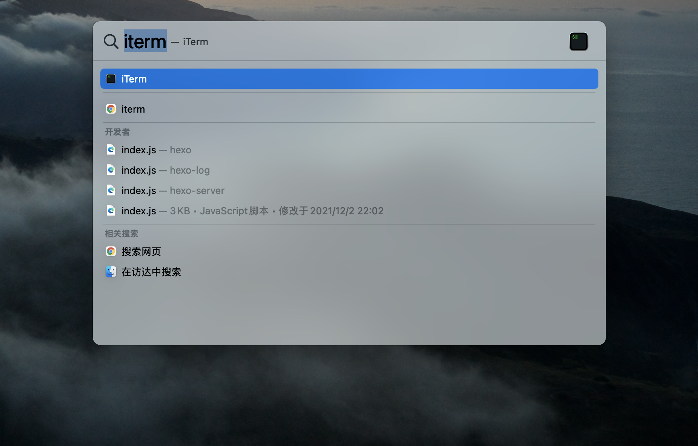
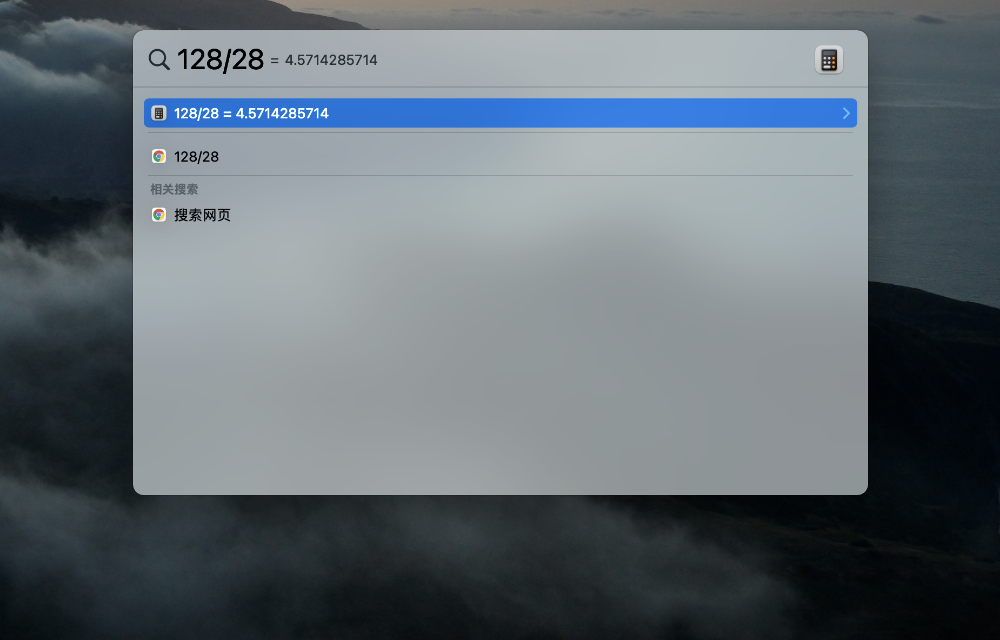

# Mac 使用小技巧

## 截图

### Mac 自带的截图方式有哪些？

1. Command + Shift + 3: 截全屏，如果有扩展屏，扩展屏也会截图
2. Command + Shift + 4: 自定义截图，光标会变成十字标志
3. Command + Shift + 5: 自定义截图，会有一个虚线框，可以自由选择截图范围

### 如何修改 Mac 截图保存的位置？

> Mac 截图默认是保存在桌面上的，如果截图很多，桌面会很杂，推荐在桌面建一个 ScreenShots 的文件，修改截图默认保存的文件。

```bash
// 第一步：修改默认路径
write com.apple.screencapture location ~/Desktop/ScreenShots

// 第二步：确保更改生效
killall SystemUIServer
```

## Spotlight 快速搜索

command + space 快速搜索电脑内的文档、App、邮件等等。

- 打开某个 App
  

- 当计算器使用
  

TODO: 待更新
